# 肥猫商城系统详细设计文档

## 文档信息

| 项目名称 | 肥猫商城系统 |
|---------|-------------|
| 文档版本 | v2.0 |
| 编写日期 | 2026年7月30日 |
| 文档类型 | 详细设计文档 |
| 适用范围 | 系统开发、测试、部署 |

---

## 目录

1. [系统概述](#1-系统概述)
2. [系统架构设计](#2-系统架构设计)
3. [功能模块设计](#3-功能模块设计)
4. [数据库设计](#4-数据库设计)
5. [业务流程设计](#5-业务流程设计)
6. [时序图设计](#6-时序图设计)
7. [状态图设计](#7-状态图设计)
8. [POS收银模块设计](#8-pos收银模块设计)
9. [人脸识别模块设计](#9-人脸识别模块设计)
10. [系统安全设计](#10-系统安全设计)
11. [性能优化设计](#11-性能优化设计)
12. [部署运维设计](#12-部署运维设计)

### 功能模块设计子目录

#### 3. 功能模块设计
- 3.1 [用户管理模块](#31-用户管理模块)
- 3.2 [商品管理模块](#32-商品管理模块)
- 3.3 [订单管理模块](#33-订单管理模块)
- 3.4 [支付管理模块](#34-支付管理模块)
- 3.5 [购物车模块](#35-购物车模块)
- 3.6 [抽奖营销模块](#36-抽奖营销模块)
- 3.7 [POS收银模块](#37-pos收银模块)
- 3.8 [供应商管理模块](#38-供应商管理模块)
- 3.9 [库存管理模块](#39-库存管理模块)
- 3.10 [人脸识别模块](#310-人脸识别模块)
- 3.11 [会员管理模块](#311-会员管理模块)
- 3.12 [促销商品管理模块](#312-促销商品管理模块)

---

## 1. 系统概述

### 1.1 系统简介

肥猫商城系统是一个基于Django框架开发的综合性电商平台，集成了商品管理、订单处理、支付结算、会员管理、抽奖营销、POS收银、供应商管理等核心功能。系统采用前后端分离架构，支持多终端访问，提供完整的电商解决方案。

### 1.2 系统目标

- 提供稳定、高效的电商交易平台
- 支持多种支付方式和订单管理
- 实现用户会员体系和积分管理
- 提供营销活动功能（抽奖、优惠券等）
- 支持线下POS收银系统
- 实现供应商和库存管理
- 支持人脸识别登录等创新功能

### 1.3 技术栈

#### 后端技术
- **框架**: Django 3.2.25
- **数据库**: MySQL 8.0
- **缓存**: Redis 6.0
- **搜索**: Whoosh (全文搜索)
- **异步任务**: Celery
- **人脸识别**: face_recognition
- **支付**: 支付宝、微信支付

#### 前端技术
- **框架**: Vue.js 2.x
- **UI组件**: Bootstrap 4
- **图表**: ECharts
- **模板引擎**: Jinja2
- **构建工具**: Webpack

#### 部署技术
- **Web服务器**: Nginx 1.18
- **应用服务器**: uWSGI 2.0
- **容器化**: Docker & Docker Compose
- **监控**: Prometheus + Grafana

---

## 2. 系统架构设计

### 2.1 总体架构图

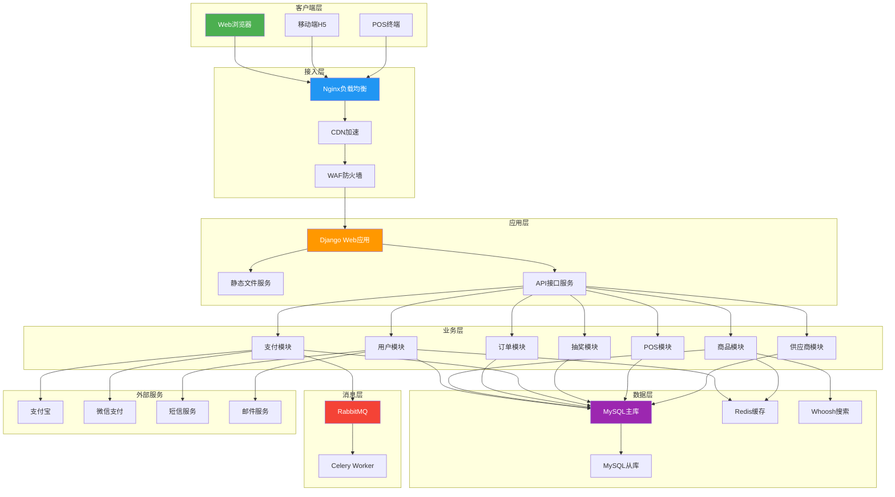
```mermaid
graph TB
    subgraph "客户端层"
        A1[Web浏览器]
        A2[移动端H5]
        A3[POS终端]
    end
    
    subgraph "接入层"
        B1[Nginx负载均衡]
        B2[CDN加速]
        B3[WAF防火墙]
    end
    
    subgraph "应用层"
        C1[Django Web应用]
        C2[静态文件服务]
        C3[API接口服务]
    end
    
    subgraph "业务层"
        D1[用户模块]
        D2[商品模块]
        D3[订单模块]
        D4[支付模块]
        D5[抽奖模块]
        D6[POS模块]
        D7[供应商模块]
    end
    
    subgraph "数据层"
        E1[MySQL主库]
        E2[MySQL从库]
        E3[Redis缓存]
        E4[Whoosh搜索]
    end
    
    subgraph "消息层"
        F1[RabbitMQ]
        F2[Celery Worker]
    end
    
    subgraph "外部服务"
        G1[支付宝]
        G2[微信支付]
        G3[短信服务]
        G4[邮件服务]
    end
    
    A1 --> B1
    A2 --> B1
    A3 --> B1
    B1 --> B2
    B2 --> B3
    B3 --> C1
    C1 --> C2
    C1 --> C3
    C3 --> D1
    C3 --> D2
    C3 --> D3
    C3 --> D4
    C3 --> D5
    C3 --> D6
    C3 --> D7
    D1 --> E1
    D2 --> E1
    D3 --> E1
    D4 --> E1
    D5 --> E1
    D6 --> E1
    D7 --> E1
    D1 --> E3
    D2 --> E3
    D2 --> E4
    D4 --> F1
    F1 --> F2
    D4 --> G1
    D4 --> G2
    D1 --> G3
    D1 --> G4
    E1 --> E2
    
    style A1 fill:#4CAF50,color:#fff
    style B1 fill:#2196F3,color:#fff
    style C1 fill:#FF9800,color:#fff
    style E1 fill:#9C27B0,color:#fff
    style F1 fill:#f44336,color:#fff
```

### 2.2 技术架构图

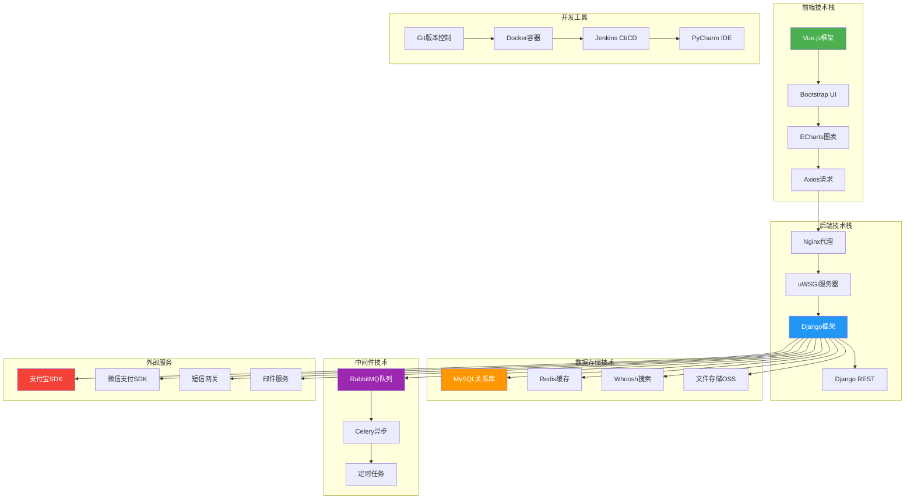
```mermaid
graph TB
    subgraph "前端技术栈"
        A1[Vue.js框架]
        A2[Bootstrap UI]
        A3[ECharts图表]
        A4[Axios请求]
    end
    
    subgraph "后端技术栈"
        B1[Django框架]
        B2[Django REST]
        B3[uWSGI服务器]
        B4[Nginx代理]
    end
    
    subgraph "数据存储技术"
        C1[MySQL关系库]
        C2[Redis缓存]
        C3[Whoosh搜索]
        C4[文件存储OSS]
    end
    
    subgraph "中间件技术"
        D1[RabbitMQ队列]
        D2[Celery异步]
        D3[定时任务]
    end
    
    subgraph "外部服务"
        E1[支付宝SDK]
        E2[微信支付SDK]
        E3[短信网关]
        E4[邮件服务]
    end
    
    subgraph "开发工具"
        F1[Git版本控制]
        F2[Docker容器]
        F3[Jenkins CI/CD]
        F4[PyCharm IDE]
    end
    
    A1 --> A2
    A2 --> A3
    A3 --> A4
    A4 --> B4
    B4 --> B3
    B3 --> B1
    B1 --> B2
    B1 --> C1
    B1 --> C2
    B1 --> C3
    B1 --> C4
    B1 --> D1
    D1 --> D2
    D2 --> D3
    B1 --> E1
    B1 --> E2
    B1 --> E3
    B1 --> E4
    F1 --> F2
    F2 --> F3
    F3 --> F4
    
    style A1 fill:#4CAF50,color:#fff
    style B1 fill:#2196F3,color:#fff
    style C1 fill:#FF9800,color:#fff
    style D1 fill:#9C27B0,color:#fff
    style E1 fill:#f44336,color:#fff
```

### 2.3 部署架构图

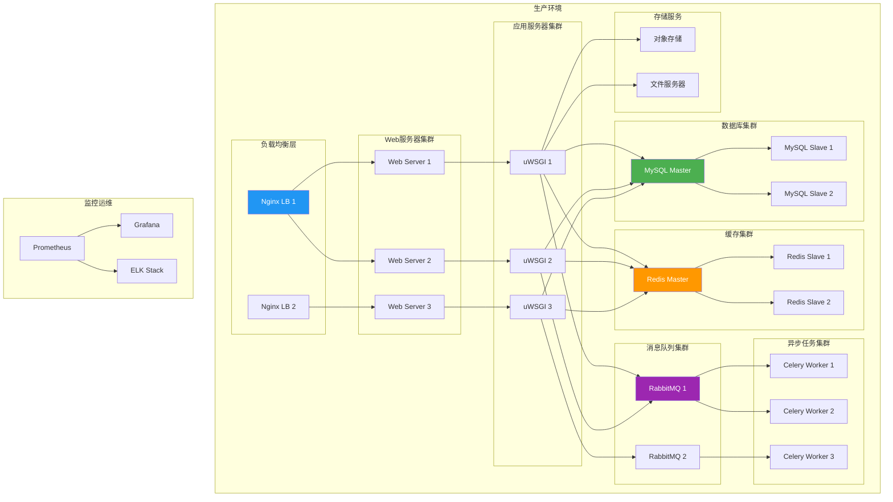
```mermaid
graph TB
    subgraph "生产环境"
        subgraph "负载均衡层"
            LB1[Nginx LB 1]
            LB2[Nginx LB 2]
        end
        
        subgraph "Web服务器集群"
            WEB1[Web Server 1]
            WEB2[Web Server 2]
            WEB3[Web Server 3]
        end
        
        subgraph "应用服务器集群"
            APP1[uWSGI 1]
            APP2[uWSGI 2]
            APP3[uWSGI 3]
        end
        
        subgraph "数据库集群"
            DB_M[MySQL Master]
            DB_S1[MySQL Slave 1]
            DB_S2[MySQL Slave 2]
        end
        
        subgraph "缓存集群"
            REDIS_M[Redis Master]
            REDIS_S1[Redis Slave 1]
            REDIS_S2[Redis Slave 2]
        end
        
        subgraph "消息队列集群"
            MQ1[RabbitMQ 1]
            MQ2[RabbitMQ 2]
        end
        
        subgraph "异步任务集群"
            WORKER1[Celery Worker 1]
            WORKER2[Celery Worker 2]
            WORKER3[Celery Worker 3]
        end
        
        subgraph "存储服务"
            OSS[对象存储]
            NFS[文件服务器]
        end
    end
    
    subgraph "监控运维"
        MON[Prometheus]
        GRAF[Grafana]
        LOG[ELK Stack]
    end
    
    LB1 --> WEB1
    LB1 --> WEB2
    LB2 --> WEB3
    WEB1 --> APP1
    WEB2 --> APP2
    WEB3 --> APP3
    APP1 --> DB_M
    APP2 --> DB_M
    APP3 --> DB_M
    DB_M --> DB_S1
    DB_M --> DB_S2
    APP1 --> REDIS_M
    APP2 --> REDIS_M
    APP3 --> REDIS_M
    REDIS_M --> REDIS_S1
    REDIS_M --> REDIS_S2
    APP1 --> MQ1
    APP2 --> MQ1
    APP3 --> MQ2
    MQ1 --> WORKER1
    MQ1 --> WORKER2
    MQ2 --> WORKER3
    APP1 --> OSS
    APP1 --> NFS
    MON --> GRAF
    MON --> LOG
    
    style LB1 fill:#2196F3,color:#fff
    style DB_M fill:#4CAF50,color:#fff
    style REDIS_M fill:#FF9800,color:#fff
    style MQ1 fill:#9C27B0,color:#fff
```

### 2.4 功能模块图

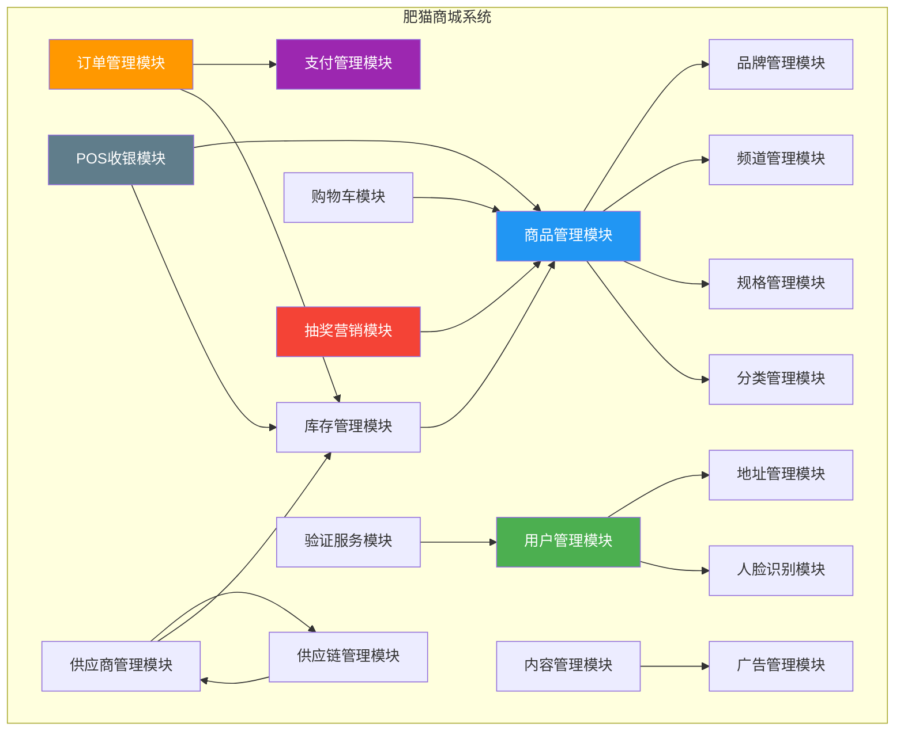
```mermaid
graph TB
    subgraph "肥猫商城系统"
        A[用户管理模块]
        B[商品管理模块]
        C[订单管理模块]
        D[支付管理模块]
        E[购物车模块]
        F[抽奖营销模块]
        G[POS收银模块]
        H[供应商管理模块]
        I[库存管理模块]
        J[供应链管理模块]
        K[品牌管理模块]
        L[频道管理模块]
        M[规格管理模块]
        N[分类管理模块]
        O[广告管理模块]
        P[地址管理模块]
        Q[人脸识别模块]
        R[内容管理模块]
        S[验证服务模块]
    end
    
    A --> P
    A --> Q
    B --> K
    B --> L
    B --> M
    B --> N
    C --> D
    C --> I
    E --> B
    F --> B
    G --> B
    G --> I
    H --> J
    H --> I
    I --> B
    J --> H
    R --> O
    S --> A
    
    style A fill:#4CAF50,color:#fff
    style B fill:#2196F3,color:#fff
    style C fill:#FF9800,color:#fff
    style D fill:#9C27B0,color:#fff
    style F fill:#f44336,color:#fff
    style G fill:#607D8B,color:#fff
```

---

## 3. 功能模块设计

### 3.1 用户管理模块

#### 3.1.1 用户模块功能图

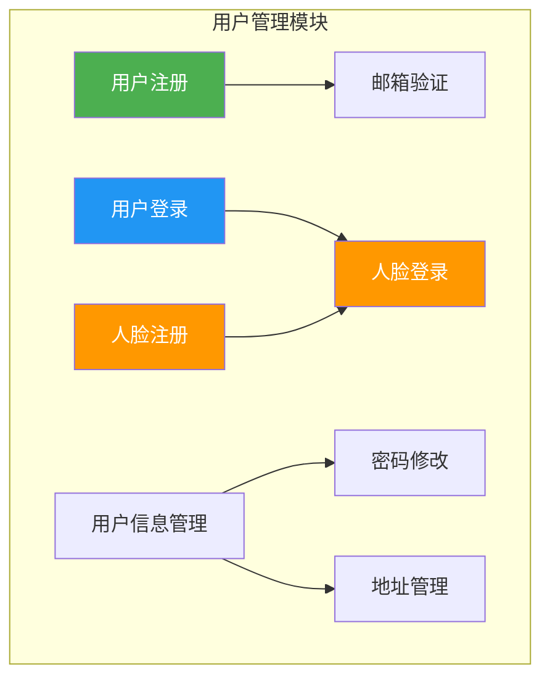
```mermaid
graph TB
    subgraph "用户管理模块"
        A[用户注册]
        B[用户登录]
        C[用户信息管理]
        D[密码修改]
        E[人脸注册]
        F[人脸登录]
        G[地址管理]
        H[邮箱验证]
    end
    
    A --> H
    B --> F
    C --> D
    C --> G
    E --> F
    
    style A fill:#4CAF50,color:#fff
    style B fill:#2196F3,color:#fff
    style E fill:#FF9800,color:#fff
    style F fill:#FF9800,color:#fff
```

#### 3.1.2 用户模块用例图

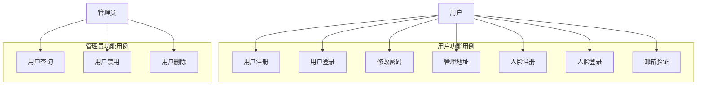
```mermaid
graph TD
    User[用户]
    Admin[管理员]
    
    subgraph "用户功能用例"
        UC1[用户注册]
        UC2[用户登录]
        UC3[修改密码]
        UC4[管理地址]
        UC5[人脸注册]
        UC6[人脸登录]
        UC7[邮箱验证]
    end
    
    subgraph "管理员功能用例"
        UC8[用户查询]
        UC9[用户禁用]
        UC10[用户删除]
    end
    
    User --> UC1
    User --> UC2
    User --> UC3
    User --> UC4
    User --> UC5
    User --> UC6
    User --> UC7
    
    Admin --> UC8
    Admin --> UC9
    Admin --> UC10
```

#### 3.1.3 用户模块类图

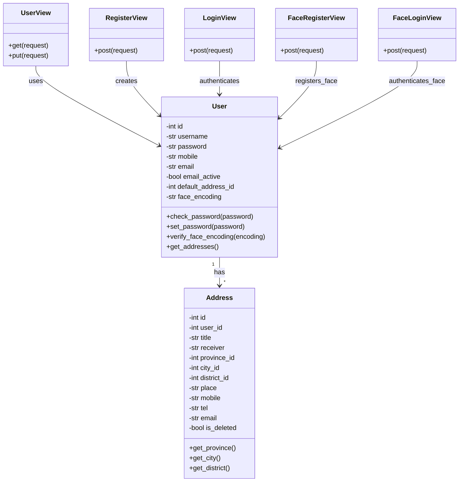
```mermaid
classDiagram
    class User {
        -int id
        -str username
        -str password
        -str mobile
        -str email
        -bool email_active
        -int default_address_id
        -str face_encoding
        +check_password(password)
        +set_password(password)
        +verify_face_encoding(encoding)
        +get_addresses()
    }
    
    class Address {
        -int id
        -int user_id
        -str title
        -str receiver
        -int province_id
        -int city_id
        -int district_id
        -str place
        -str mobile
        -str tel
        -str email
        -bool is_deleted
        +get_province()
        +get_city()
        +get_district()
    }
    
    class UserView {
        +get(request)
        +put(request)
    }
    
    class RegisterView {
        +post(request)
    }
    
    class LoginView {
        +post(request)
    }
    
    class FaceRegisterView {
        +post(request)
    }
    
    class FaceLoginView {
        +post(request)
    }
    
    User "1" --> "*" Address : has
    UserView --> User : uses
    RegisterView --> User : creates
    LoginView --> User : authenticates
    FaceRegisterView --> User : registers_face
    FaceLoginView --> User : authenticates_face
```

#### 3.1.4 用户模块内部交互拓扑图

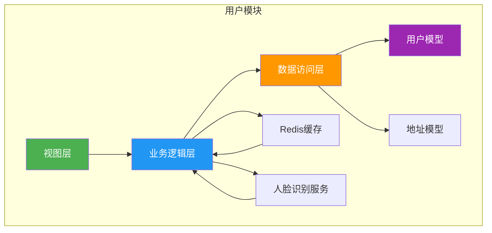
```mermaid
graph TD
    subgraph "用户模块"
        A[视图层]
        B[业务逻辑层]
        C[数据访问层]
        D[用户模型]
        E[地址模型]
        F[Redis缓存]
        G[人脸识别服务]
    end
    
    A --> B
    B --> C
    C --> D
    C --> E
    B --> F
    B --> G
    F --> B
    G --> B
    
    style A fill:#4CAF50,color:#fff
    style B fill:#2196F3,color:#fff
    style C fill:#FF9800,color:#fff
    style D fill:#9C27B0,color:#fff
```

### 3.2 商品管理模块

#### 3.2.1 商品模块功能图

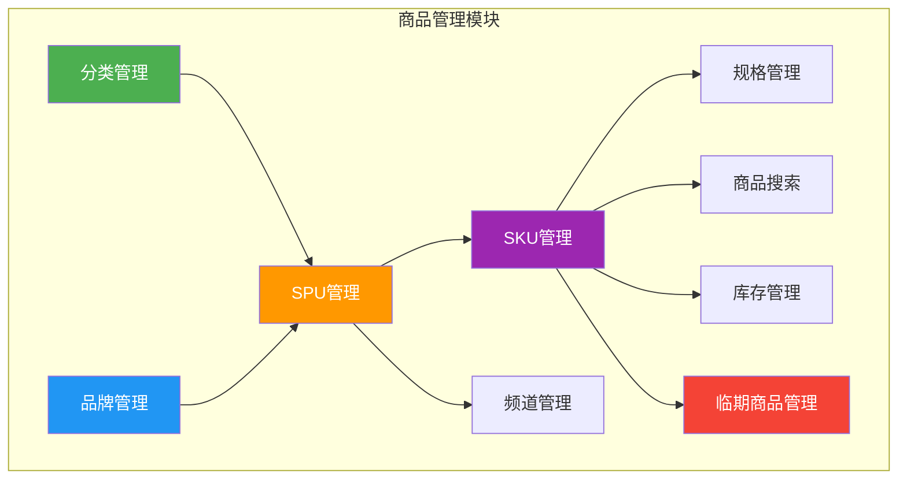
```mermaid
graph TB
    subgraph "商品管理模块"
        A[分类管理]
        B[品牌管理]
        C[SPU管理]
        D[SKU管理]
        E[规格管理]
        F[频道管理]
        G[商品搜索]
        H[库存管理]
        I[临期商品管理]
    end
    
    A --> C
    B --> C
    C --> D
    D --> E
    C --> F
    D --> G
    D --> H
    D --> I
    
    style A fill:#4CAF50,color:#fff
    style B fill:#2196F3,color:#fff
    style C fill:#FF9800,color:#fff
    style D fill:#9C27B0,color:#fff
    style I fill:#f44336,color:#fff
```

#### 3.2.2 商品模块用例图

```mermaid
graph TD
    User[用户]
    Admin[管理员]
    Supplier[供应商]
    
    subgraph "商品功能用例"
        UC1[浏览商品]
        UC2[搜索商品]
        UC3[查看商品详情]
        UC4[商品分类浏览]
    end
    
    subgraph "管理员功能用例"
        UC5[添加商品]
        UC6[编辑商品]
        UC7[删除商品]
        UC8[管理分类]
        UC9[管理品牌]
        UC10[管理规格]
        UC11[管理频道]
        UC15[临期商品管理]
        UC16[临期预警设置]
        UC17[临期商品促销]
    end
    
    subgraph "供应商功能用例"
        UC12[上架商品]
        UC13[更新库存]
        UC14[设置价格]
    end
    
    User --> UC1
    User --> UC2
    User --> UC3
    User --> UC4
    
    Admin --> UC5
    Admin --> UC6
    Admin --> UC7
    Admin --> UC8
    Admin --> UC9
    Admin --> UC10
    Admin --> UC11
    Admin --> UC15
    Admin --> UC16
    Admin --> UC17
    
    Supplier --> UC12
    Supplier --> UC13
    Supplier --> UC14
```

#### 3.2.3 商品模块类图

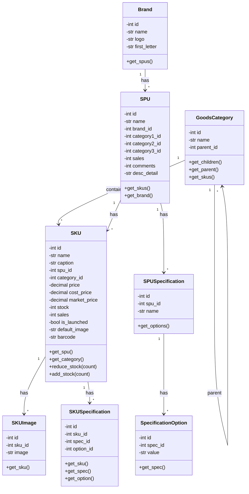
```mermaid
classDiagram
    class GoodsCategory {
        -int id
        -str name
        -int parent_id
        +get_children()
        +get_parent()
        +get_skus()
    }
    
    class Brand {
        -int id
        -str name
        -str logo
        -str first_letter
        +get_spus()
    }
    
    class SPU {
        -int id
        -str name
        -int brand_id
        -int category1_id
        -int category2_id
        -int category3_id
        -int sales
        -int comments
        -str desc_detail
        +get_skus()
        +get_brand()
    }
    
    class SKU {
        -int id
        -str name
        -str caption
        -int spu_id
        -int category_id
        -decimal price
        -decimal cost_price
        -decimal market_price
        -int stock
        -int sales
        -bool is_launched
        -str default_image
        -str barcode
        +get_spu()
        +get_category()
        +reduce_stock(count)
        +add_stock(count)
    }
    
    class SKUImage {
        -int id
        -int sku_id
        -str image
        +get_sku()
    }
    
    class SPUSpecification {
        -int id
        -int spu_id
        -str name
        +get_options()
    }
    
    class SpecificationOption {
        -int id
        -int spec_id
        -str value
        +get_spec()
    }
    
    class SKUSpecification {
        -int id
        -int sku_id
        -int spec_id
        -int option_id
        +get_sku()
        +get_spec()
        +get_option()
    }
    
    GoodsCategory "1" --> "*" GoodsCategory : parent
    GoodsCategory "1" --> "*" SKU : contains
    Brand "1" --> "*" SPU : has
    SPU "1" --> "*" SKU : has
    SKU "1" --> "*" SKUImage : has
    SPU "1" --> "*" SPUSpecification : has
    SPUSpecification "1" --> "*" SpecificationOption : has
    SKU "1" --> "*" SKUSpecification : has
```

#### 3.2.4 商品模块内部交互拓扑图

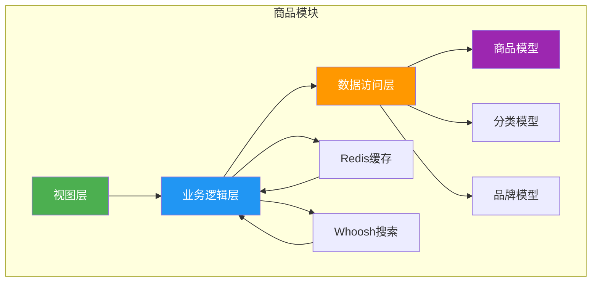
```mermaid
graph TD
    subgraph "商品模块"
        A[视图层]
        B[业务逻辑层]
        C[数据访问层]
        D[商品模型]
        E[分类模型]
        F[品牌模型]
        G[Redis缓存]
        H[Whoosh搜索]
    end
    
    A --> B
    B --> C
    C --> D
    C --> E
    C --> F
    B --> G
    B --> H
    G --> B
    H --> B
    
    style A fill:#4CAF50,color:#fff
    style B fill:#2196F3,color:#fff
    style C fill:#FF9800,color:#fff
    style D fill:#9C27B0,color:#fff
```

#### 3.2.5 临期商品管理功能设计

##### 3.2.5.1 临期商品业务说明

临期商品管理是指对即将过期的商品进行监控、预警、促销和处理的完整管理流程。系统根据商品的生产日期和保质期自动计算过期日期，对临期商品进行分类管理，帮助商家减少库存损失。

**业务场景**
- 商品即将过期需要降价促销
- 顾客需要查看临期商品优惠信息
- 管理员需要设置临期预警规则
- 系统自动推送临期商品提醒

**临期分类**
- **临期预警期**: 距离过期30天内的商品
- **临期促销期**: 距离过期15天内的商品
- **临期紧急期**: 距离过期7天内的商品
- **已过期**: 已超过过期日期的商品

##### 3.2.5.2 临期商品管理流程图

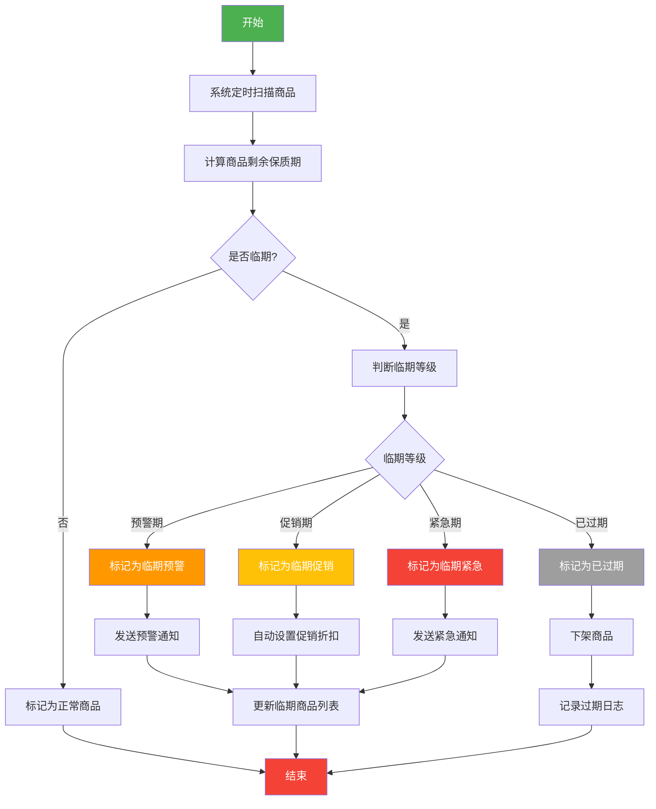
```mermaid
flowchart TD
    Start[开始] --> A[系统定时扫描商品]
    A --> B[计算商品剩余保质期]
    B --> C{是否临期?}
    C -->|否| D[标记为正常商品]
    C -->|是| E[判断临期等级]
    E --> F{临期等级}
    F -->|预警期| G[标记为临期预警]
    F -->|促销期| H[标记为临期促销]
    F -->|紧急期| I[标记为临期紧急]
    F -->|已过期| J[标记为已过期]
    G --> K[发送预警通知]
    H --> L[自动设置促销折扣]
    I --> M[发送紧急通知]
    J --> N[下架商品]
    K --> O[更新临期商品列表]
    L --> O
    M --> O
    N --> P[记录过期日志]
    D --> End[结束]
    O --> End
    P --> End
    
    style Start fill:#4CAF50,color:#fff
    style End fill:#f44336,color:#fff
    style G fill:#FF9800,color:#fff
    style H fill:#FFC107,color:#fff
    style I fill:#f44336,color:#fff
    style J fill:#9E9E9E,color:#fff
```

##### 3.2.5.3 临期商品管理用例图

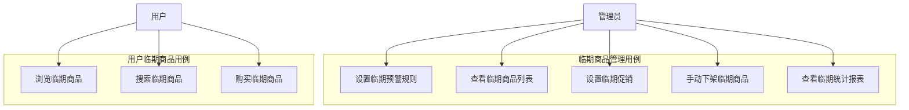
```mermaid
graph TD
    Admin[管理员]
    User[用户]
    
    subgraph "临期商品管理用例"
        UC1[设置临期预警规则]
        UC2[查看临期商品列表]
        UC3[设置临期促销]
        UC4[手动下架临期商品]
        UC5[查看临期统计报表]
    end
    
    subgraph "用户临期商品用例"
        UC6[浏览临期商品]
        UC7[搜索临期商品]
        UC8[购买临期商品]
    end
    
    Admin --> UC1
    Admin --> UC2
    Admin --> UC3
    Admin --> UC4
    Admin --> UC5
    
    User --> UC6
    User --> UC7
    User --> UC8
```

##### 3.2.5.4 临期商品管理时序图

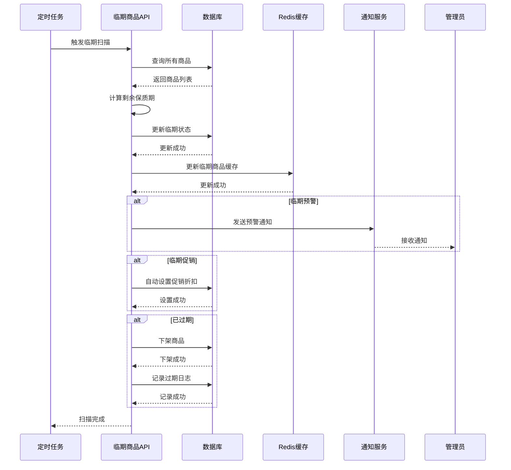
```mermaid
sequenceDiagram
    participant System as 定时任务
    participant API as 临期商品API
    participant DB as 数据库
    participant Cache as Redis缓存
    participant Notify as 通知服务
    participant Admin as 管理员
    
    System->>API: 触发临期扫描
    API->>DB: 查询所有商品
    DB-->>API: 返回商品列表
    API->>API: 计算剩余保质期
    API->>DB: 更新临期状态
    DB-->>API: 更新成功
    API->>Cache: 更新临期商品缓存
    Cache-->>API: 更新成功
    
    alt 临期预警
        API->>Notify: 发送预警通知
        Notify-->>Admin: 接收通知
    end
    
    alt 临期促销
        API->>DB: 自动设置促销折扣
        DB-->>API: 设置成功
    end
    
    alt 已过期
        API->>DB: 下架商品
        DB-->>API: 下架成功
        API->>DB: 记录过期日志
        DB-->>API: 记录成功
    end
    
    API-->>System: 扫描完成
```

##### 3.2.5.5 临期商品管理类图

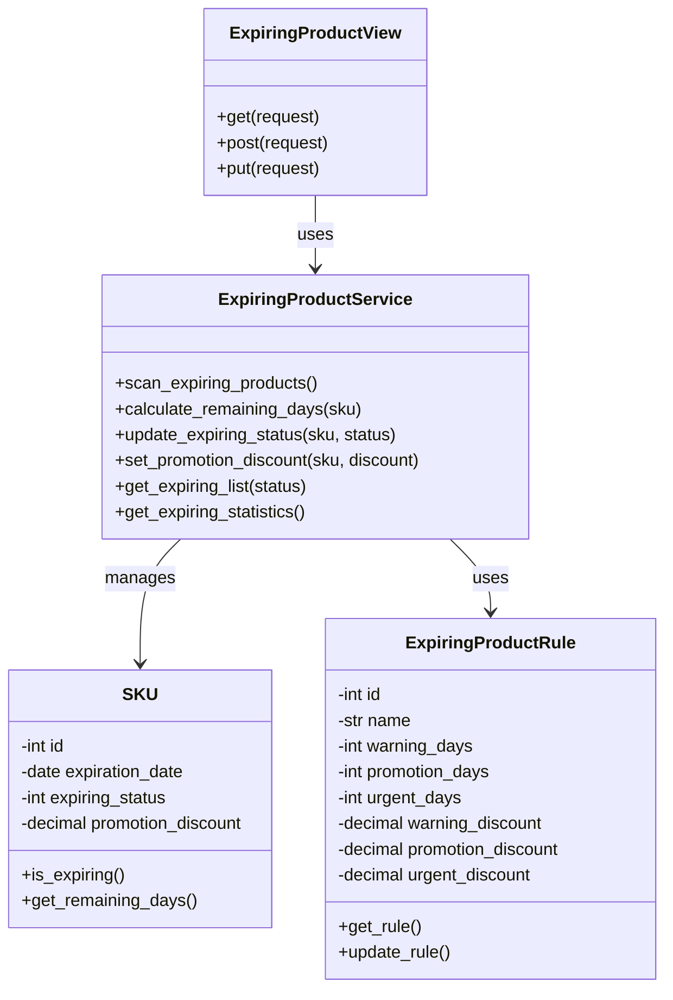
```mermaid
classDiagram
    class ExpiringProductService {
        +scan_expiring_products()
        +calculate_remaining_days(sku)
        +update_expiring_status(sku, status)
        +set_promotion_discount(sku, discount)
        +get_expiring_list(status)
        +get_expiring_statistics()
    }
    
    class ExpiringProductRule {
        -int id
        -str name
        -int warning_days
        -int promotion_days
        -int urgent_days
        -decimal warning_discount
        -decimal promotion_discount
        -decimal urgent_discount
        +get_rule()
        +update_rule()
    }
    
    class ExpiringProductView {
        +get(request)
        +post(request)
        +put(request)
    }
    
    class SKU {
        -int id
        -date expiration_date
        -int expiring_status
        -decimal promotion_discount
        +is_expiring()
        +get_remaining_days()
    }
    
    ExpiringProductService --> SKU : manages
    ExpiringProductService --> ExpiringProductRule : uses
    ExpiringProductView --> ExpiringProductService : uses
```

##### 3.2.5.6 临期商品数据表设计

**tb_expiring_product_rule (临期商品规则表)**

| 字段名 | 类型 | 长度 | 允许空 | 默认值 | 说明 |
|--------|------|------|--------|--------|------|
| id | INT | 11 | NO | AUTO_INCREMENT | 主键ID |
| name | VARCHAR | 50 | NO | - | 规则名称 |
| warning_days | INT | 11 | NO | 30 | 预警天数 |
| promotion_days | INT | 11 | NO | 15 | 促销天数 |
| urgent_days | INT | 11 | NO | 7 | 紧急天数 |
| warning_discount | DECIMAL | 5,2 | NO | 0.90 | 预警折扣(90%) |
| promotion_discount | DECIMAL | 5,2 | NO | 0.70 | 促销折扣(70%) |
| urgent_discount | DECIMAL | 5,2 | NO | 0.50 | 紧急折扣(50%) |
| is_active | BOOLEAN | - | NO | True | 是否启用 |
| create_time | DATETIME | - | NO | CURRENT_TIMESTAMP | 创建时间 |
| update_time | DATETIME | - | NO | CURRENT_TIMESTAMP | 更新时间 |

**索引设计**
- PRIMARY KEY: `id`
- UNIQUE KEY: `name`
- INDEX: `is_active`

**tb_expiring_product_log (临期商品日志表)**

| 字段名 | 类型 | 长度 | 允许空 | 默认值 | 说明 |
|--------|------|------|--------|--------|------|
| id | INT | 11 | NO | AUTO_INCREMENT | 主键ID |
| sku_id | INT | 11 | NO | - | 商品SKU ID |
| old_status | SMALLINT | 6 | NO | - | 原状态 |
| new_status | SMALLINT | 6 | NO | - | 新状态 |
| old_discount | DECIMAL | 5,2 | YES | NULL | 原折扣 |
| new_discount | DECIMAL | 5,2 | YES | NULL | 新折扣 |
| action_type | VARCHAR | 20 | NO | - | 操作类型 |
| remark | VARCHAR | 200 | YES | NULL | 备注 |
| create_time | DATETIME | - | NO | CURRENT_TIMESTAMP | 创建时间 |

**索引设计**
- PRIMARY KEY: `id`
- INDEX: `sku_id`
- INDEX: `create_time`
- INDEX: `action_type`

**SKU表新增字段**

| 字段名 | 类型 | 长度 | 允许空 | 默认值 | 说明 |
|--------|------|------|--------|--------|------|
| expiring_status | SMALLINT | 6 | NO | 0 | 临期状态(0:正常,1:预警,2:促销,3:紧急,4:已过期) |
| promotion_discount | DECIMAL | 5,2 | YES | NULL | 促销折扣 |

**索引设计**
- INDEX: `expiring_status`

##### 3.2.5.7 临期商品状态流转图

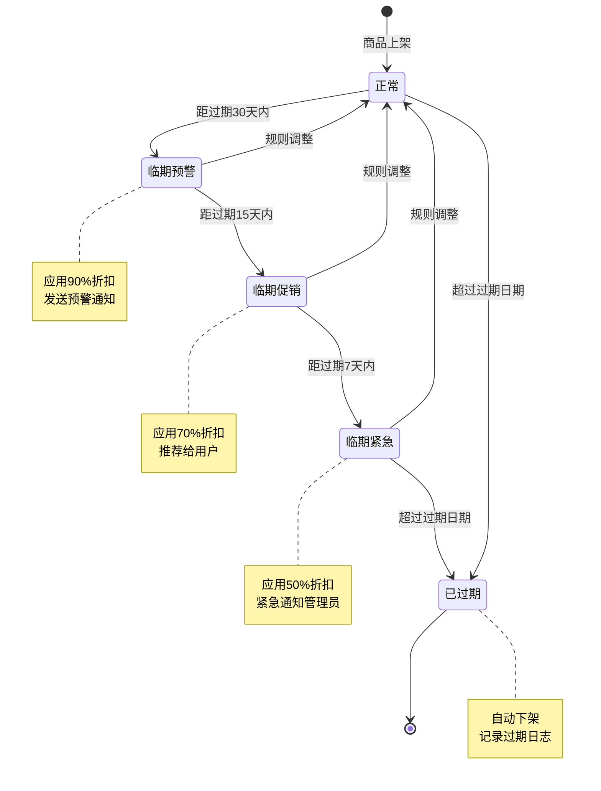
```mermaid
stateDiagram-v2
    [*] --> 正常: 商品上架
    正常 --> 临期预警: 距过期30天内
    临期预警 --> 临期促销: 距过期15天内
    临期促销 --> 临期紧急: 距过期7天内
    临期紧急 --> 已过期: 超过过期日期
    正常 --> 已过期: 超过过期日期
    临期预警 --> 正常: 规则调整
    临期促销 --> 正常: 规则调整
    临期紧急 --> 正常: 规则调整
    已过期 --> [*]
    
    note right of 临期预警
        应用90%折扣
        发送预警通知
    end note
    
    note right of 临期促销
        应用70%折扣
        推荐给用户
    end note
    
    note right of 临期紧急
        应用50%折扣
        紧急通知管理员
    end note
    
    note right of 已过期
        自动下架
        记录过期日志
    end note
```

##### 3.2.5.8 临期商品功能特点

1. **自动监控**: 系统定时扫描商品保质期，自动识别临期商品
2. **分级管理**: 根据剩余保质期分为预警、促销、紧急三个等级
3. **自动促销**: 根据临期等级自动应用不同的促销折扣
4. **智能预警**: 临期商品自动发送通知给管理员
5. **用户推荐**: 临期商品在首页和分类页优先展示
6. **统计报表**: 提供临期商品统计和损失分析
7. **灵活配置**: 管理员可自定义临期天数和折扣比例

---

### 3.3 订单管理模块

#### 3.3.1 订单模块功能图

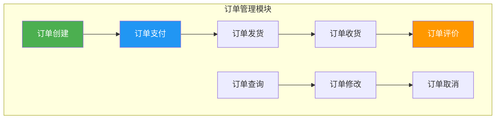
```mermaid
graph TB
    subgraph "订单管理模块"
        A[订单创建]
        B[订单查询]
        C[订单修改]
        D[订单取消]
        E[订单支付]
        F[订单发货]
        G[订单收货]
        H[订单评价]
    end
    
    A --> E
    E --> F
    F --> G
    G --> H
    B --> C
    C --> D
    
    style A fill:#4CAF50,color:#fff
    style E fill:#2196F3,color:#fff
    style H fill:#FF9800,color:#fff
```

#### 3.3.2 订单模块用例图

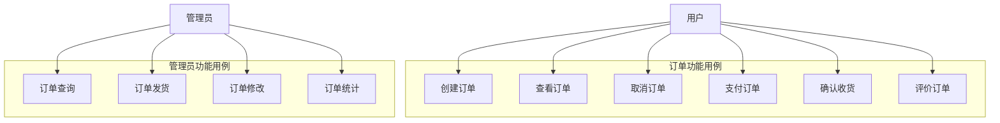
```mermaid
graph TD
    User[用户]
    Admin[管理员]
    
    subgraph "订单功能用例"
        UC1[创建订单]
        UC2[查看订单]
        UC3[取消订单]
        UC4[支付订单]
        UC5[确认收货]
        UC6[评价订单]
    end
    
    subgraph "管理员功能用例"
        UC7[订单查询]
        UC8[订单发货]
        UC9[订单修改]
        UC10[订单统计]
    end
    
    User --> UC1
    User --> UC2
    User --> UC3
    User --> UC4
    User --> UC5
    User --> UC6
    
    Admin --> UC7
    Admin --> UC8
    Admin --> UC9
    Admin --> UC10
```

#### 3.3.3 订单模块类图

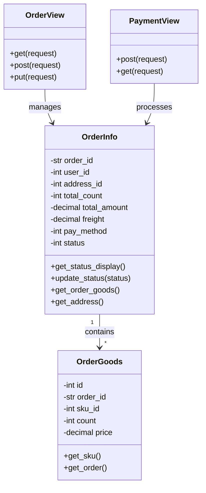
```mermaid
classDiagram
    class OrderInfo {
        -str order_id
        -int user_id
        -int address_id
        -int total_count
        -decimal total_amount
        -decimal freight
        -int pay_method
        -int status
        +get_status_display()
        +update_status(status)
        +get_order_goods()
        +get_address()
    }
    
    class OrderGoods {
        -int id
        -str order_id
        -int sku_id
        -int count
        -decimal price
        +get_sku()
        +get_order()
    }
    
    class OrderView {
        +get(request)
        +post(request)
        +put(request)
    }
    
    class PaymentView {
        +post(request)
        +get(request)
    }
    
    OrderInfo "1" --> "*" OrderGoods : contains
    OrderView --> OrderInfo : manages
    PaymentView --> OrderInfo : processes
```

#### 3.3.4 订单模块内部交互拓扑图

```mermaid
graph TD
    subgraph "订单模块"
        A[视图层]
        B[业务逻辑层]
        C[数据访问层]
        D[订单模型]
        E[订单商品模型]
        F[Redis缓存]
        G[库存服务]
        H[支付服务]
    end
    
    A --> B
    B --> C
    C --> D
    C --> E
    B --> F
    B --> G
    B --> H
    F --> B
    G --> B
    H --> B
    
    style A fill:#4CAF50,color:#fff
    style B fill:#2196F3,color:#fff
    style C fill:#FF9800,color:#fff
    style D fill:#9C27B0,color:#fff
```

### 3.4 支付管理模块

#### 3.4.1 支付模块功能图

```mermaid
graph TB
    subgraph "支付管理模块"
        A[支付宝支付]
        B[微信支付]
        C[货到付款]
        D[支付查询]
        E[支付回调]
        F[退款处理]
    end
    
    A --> D
    A --> E
    B --> D
    B --> E
    C --> D
    D --> F
    
    style A fill:#4CAF50,color:#fff
    style B fill:#2196F3,color:#fff
    style C fill:#FF9800,color:#fff
```

#### 3.4.2 支付模块用例图

```mermaid
graph TD
    User[用户]
    Admin[管理员]
    
    subgraph "支付功能用例"
        UC1[支付宝支付]
        UC2[微信支付]
        UC3[货到付款]
        UC4[支付查询]
        UC5[申请退款]
    end
    
    subgraph "管理员功能用例"
        UC6[支付审核]
        UC7[退款处理]
        UC8[支付统计]
    end
    
    User --> UC1
    User --> UC2
    User --> UC3
    User --> UC4
    User --> UC5
    
    Admin --> UC6
    Admin --> UC7
    Admin --> UC8
```

#### 3.4.3 支付模块类图

```mermaid
classDiagram
    class Payment {
        -str payment_id
        -str order_id
        -int pay_method
        -decimal amount
        -int status
        -str transaction_id
        +create_payment()
        +query_payment()
        +process_callback()
        +refund()
    }
    
    class AlipayService {
        +create_order()
        +query_order()
        +verify_callback()
        +refund()
    }
    
    class WechatPayService {
        +create_order()
        +query_order()
        +verify_callback()
        +refund()
    }
    
    class PaymentView {
        +post(request)
        +get(request)
    }
    
    Payment --> AlipayService : uses
    Payment --> WechatPayService : uses
    PaymentView --> Payment : manages
```

#### 3.4.4 支付模块内部交互拓扑图

```mermaid
graph TD
    subgraph "支付模块"
        A[视图层]
        B[业务逻辑层]
        C[数据访问层]
        D[支付模型]
        E[支付宝服务]
        F[微信支付服务]
        G[Redis缓存]
    end
    
    A --> B
    B --> C
    C --> D
    B --> E
    B --> F
    B --> G
    E --> B
    F --> B
    G --> B
    
    style A fill:#4CAF50,color:#fff
    style B fill:#2196F3,color:#fff
    style C fill:#FF9800,color:#fff
    style D fill:#9C27B0,color:#fff
```

### 3.5 购物车模块

#### 3.5.1 购物车模块功能图

```mermaid
graph TB
    subgraph "购物车模块"
        A[添加商品]
        B[修改数量]
        C[删除商品]
        D[清空购物车]
        E[选中商品]
        F[计算总价]
    end
    
    A --> B
    B --> E
    E --> F
    C --> D
    
    style A fill:#4CAF50,color:#fff
    style B fill:#2196F3,color:#fff
    style F fill:#FF9800,color:#fff
```

#### 3.5.2 购物车模块用例图

```mermaid
graph TD
    User[用户]
    
    subgraph "购物车功能用例"
        UC1[添加商品到购物车]
        UC2[修改商品数量]
        UC3[删除购物车商品]
        UC4[清空购物车]
        UC5[选中/取消选中]
        UC6[查看购物车]
    end
    
    User --> UC1
    User --> UC2
    User --> UC3
    User --> UC4
    User --> UC5
    User --> UC6
```

#### 3.5.3 购物车模块类图

```mermaid
classDiagram
    class Cart {
        -int user_id
        -int sku_id
        -int count
        -bool selected
        +get_sku()
        +get_total_price()
        +update_count()
        +delete()
    }
    
    class CartView {
        +get(request)
        +post(request)
        +put(request)
        +delete(request)
    }
    
    CartView --> Cart : manages
```

#### 3.5.4 购物车模块内部交互拓扑图

```mermaid
graph TD
    subgraph "购物车模块"
        A[视图层]
        B[业务逻辑层]
        C[Redis缓存]
        D[商品服务]
    end
    
    A --> B
    B --> C
    B --> D
    C --> B
    D --> B
    
    style A fill:#4CAF50,color:#fff
    style B fill:#2196F3,color:#fff
    style C fill:#FF9800,color:#fff
```

### 3.6 抽奖营销模块

#### 3.6.1 抽奖模块功能图

```mermaid
graph TB
    subgraph "抽奖营销模块"
        A[奖项等级管理]
        B[奖品管理]
        C[抽奖游戏]
        D[中奖记录]
        E[概率配置]
        F[转盘动画]
    end
    
    A --> E
    A --> B
    B --> C
    C --> D
    C --> F
    
    style A fill:#4CAF50,color:#fff
    style C fill:#2196F3,color:#fff
    style D fill:#FF9800,color:#fff
```

#### 3.6.2 抽奖模块用例图

```mermaid
graph TD
    User[用户]
    Admin[管理员]
    
    subgraph "抽奖功能用例"
        UC1[参与抽奖]
        UC2[查看中奖记录]
        UC3[查看抽奖规则]
    end
    
    subgraph "管理员功能用例"
        UC4[配置奖项等级]
        UC5[配置奖品]
        UC6[设置中奖概率]
        UC7[查看中奖统计]
        UC8[管理中奖记录]
    end
    
    User --> UC1
    User --> UC2
    User --> UC3
    
    Admin --> UC4
    Admin --> UC5
    Admin --> UC6
    Admin --> UC7
    Admin --> UC8
```

#### 3.6.3 抽奖模块类图

```mermaid
classDiagram
    class PrizeLevel {
        -int id
        -str name
        -int level
        -decimal probability
        -str color
        +get_prizes()
        +get_records()
    }
    
    class Prize {
        -int id
        -int prize_level_id
        -int sku_id
        -int quantity
        +get_level()
        +get_sku()
        +reduce_quantity()
    }
    
    class LotteryRecord {
        -int id
        -int user_id
        -int prize_level_id
        -int prize_id
        -bool is_won
        -str ip_address
        +get_user()
        +get_prize()
        +get_level()
    }
    
    class LotteryWheelView {
        +get(request)
    }
    
    class LotteryDrawView {
        +post(request)
    }
    
    class LotteryRecordListView {
        +get(request)
    }
    
    PrizeLevel "1" --> "*" Prize : defines
    PrizeLevel "1" --> "*" LotteryRecord : awarded in
    Prize "1" --> "*" LotteryRecord : won as
    LotteryWheelView --> PrizeLevel : displays
    LotteryDrawView --> PrizeLevel : uses
    LotteryDrawView --> LotteryRecord : creates
    LotteryRecordListView --> LotteryRecord : lists
```

#### 3.6.4 抽奖模块内部交互拓扑图

```mermaid
graph TD
    subgraph "抽奖模块"
        A[视图层]
        B[业务逻辑层]
        C[数据访问层]
        D[奖项模型]
        E[奖品模型]
        F[记录模型]
        G[Redis缓存]
        H[概率算法]
    end
    
    A --> B
    B --> C
    C --> D
    C --> E
    C --> F
    B --> G
    B --> H
    G --> B
    H --> B
    
    style A fill:#4CAF50,color:#fff
    style B fill:#2196F3,color:#fff
    style C fill:#FF9800,color:#fff
    style D fill:#9C27B0,color:#fff
```

### 3.7 POS收银模块

#### 3.7.1 POS模块功能图

```mermaid
graph TB
    subgraph "POS收银模块"
        A[商品扫码]
        B[购物车管理]
        C[会员识别]
        D[收银结算]
        E[支付处理]
        F[小票打印]
        G[交易记录]
    end
    
    A --> B
    B --> C
    C --> D
    D --> E
    E --> F
    E --> G
    
    style A fill:#4CAF50,color:#fff
    style D fill:#2196F3,color:#fff
    style G fill:#FF9800,color:#fff
```

#### 3.7.2 POS模块用例图

```mermaid
graph TD
    Cashier[收银员]
    Manager[店长]
    
    subgraph "POS功能用例"
        UC1[扫描商品条码]
        UC2[添加到购物车]
        UC3[修改商品数量]
        UC4[删除商品]
        UC5[识别会员]
        UC6[应用折扣]
        UC7[选择支付方式]
        UC8[完成支付]
        UC9[打印小票]
    end
    
    subgraph "管理功能用例"
        UC10[查看交易记录]
        UC11[交接班]
        UC12[退款处理]
        UC13[数据统计]
    end
    
    Cashier --> UC1
    Cashier --> UC2
    Cashier --> UC3
    Cashier --> UC4
    Cashier --> UC5
    Cashier --> UC6
    Cashier --> UC7
    Cashier --> UC8
    Cashier --> UC9
    
    Manager --> UC10
    Manager --> UC11
    Manager --> UC12
    Manager --> UC13
```

#### 3.7.3 POS模块类图

```mermaid
classDiagram
    class POSOrder {
        -str order_id
        -int cashier_id
        -decimal total_amount
        -decimal discount_amount
        -decimal pay_amount
        -int pay_method
        -int status
        +calculate_total()
        +apply_discount()
        +complete_payment()
    }
    
    class POSOrderItem {
        -int id
        -str order_id
        -int sku_id
        -int quantity
        -decimal price
        -decimal subtotal
        +get_sku()
    }
    
    class POSView {
        +get(request)
        +post(request)
    }
    
    class BarcodeScanner {
        +scan_barcode()
        +get_product_info()
    }
    
    class ReceiptPrinter {
        +print_receipt()
        +format_receipt()
    }
    
    POSOrder "1" --> "*" POSOrderItem : contains
    POSView --> POSOrder : manages
    POSView --> BarcodeScanner : uses
    POSView --> ReceiptPrinter : uses
```

#### 3.7.4 POS模块内部交互拓扑图

```mermaid
graph TD
    subgraph "POS模块"
        A[视图层]
        B[业务逻辑层]
        C[数据访问层]
        D[订单模型]
        E[订单商品模型]
        F[条码扫描器]
        G[小票打印机]
        H[会员服务]
    end
    
    A --> B
    B --> C
    C --> D
    C --> E
    B --> F
    B --> G
    B --> H
    F --> B
    G --> B
    H --> B
    
    style A fill:#4CAF50,color:#fff
    style B fill:#2196F3,color:#fff
    style C fill:#FF9800,color:#fff
    style D fill:#9C27B0,color:#fff
```

### 3.8 供应商管理模块

#### 3.8.1 供应商模块功能图

```mermaid
graph TB
    subgraph "供应商管理模块"
        A[供应商注册]
        B[供应商审核]
        C[商品上架]
        D[库存管理]
        E[订单处理]
        F[结算管理]
    end
    
    A --> B
    B --> C
    C --> D
    C --> E
    E --> F
    
    style A fill:#4CAF50,color:#fff
    style C fill:#2196F3,color:#fff
    style E fill:#FF9800,color:#fff
```

#### 3.8.2 供应商模块用例图

```mermaid
graph TD
    Supplier[供应商]
    Admin[管理员]
    
    subgraph "供应商功能用例"
        UC1[供应商注册]
        UC2[商品上架]
        UC3[库存管理]
        UC4[订单处理]
        UC5[查看结算]
    end
    
    subgraph "管理员功能用例"
        UC6[供应商审核]
        UC7[供应商管理]
        UC8[结算审核]
        UC9[数据统计]
    end
    
    Supplier --> UC1
    Supplier --> UC2
    Supplier --> UC3
    Supplier --> UC4
    Supplier --> UC5
    
    Admin --> UC6
    Admin --> UC7
    Admin --> UC8
    Admin --> UC9
```

#### 3.8.3 供应商模块类图

```mermaid
classDiagram
    class Supplier {
        -int id
        -str name
        -str contact
        -str phone
        -str address
        -int status
        +get_products()
        +get_orders()
    }
    
    class SupplierProduct {
        -int id
        -int supplier_id
        -int sku_id
        -decimal supply_price
        -int stock
        +get_supplier()
        +get_sku()
    }
    
    class SupplierOrder {
        -int id
        -int supplier_id
        -str order_id
        -decimal amount
        -int status
        +get_supplier()
        +get_order()
    }
    
    class SupplierView {
        +get(request)
        +post(request)
    }
    
    Supplier "1" --> "*" SupplierProduct : supplies
    Supplier "1" --> "*" SupplierOrder : receives
    SupplierView --> Supplier : manages
```

#### 3.8.4 供应商模块内部交互拓扑图

```mermaid
graph TD
    subgraph "供应商模块"
        A[视图层]
        B[业务逻辑层]
        C[数据访问层]
        D[供应商模型]
        E[商品模型]
        F[订单模型]
        G[Redis缓存]
    end
    
    A --> B
    B --> C
    C --> D
    C --> E
    C --> F
    B --> G
    G --> B
    
    style A fill:#4CAF50,color:#fff
    style B fill:#2196F3,color:#fff
    style C fill:#FF9800,color:#fff
    style D fill:#9C27B0,color:#fff
```

### 3.9 库存管理模块

#### 3.9.1 库存模块功能图

```mermaid
graph TB
    subgraph "库存管理模块"
        A[库存查询]
        B[库存入库]
        C[库存出库]
        D[库存盘点]
        E[库存预警]
        F[库存调拨]
    end
    
    A --> B
    B --> C
    C --> D
    D --> E
    E --> F
    
    style A fill:#4CAF50,color:#fff
    style B fill:#2196F3,color:#fff
    style E fill:#FF9800,color:#fff
```

#### 3.9.2 库存模块用例图

```mermaid
graph TD
    Admin[管理员]
    Supplier[供应商]
    
    subgraph "库存功能用例"
        UC1[库存查询]
        UC2[库存入库]
        UC3[库存出库]
        UC4[库存盘点]
        UC5[库存预警设置]
        UC6[库存调拨]
    end
    
    Admin --> UC1
    Admin --> UC2
    Admin --> UC3
    Admin --> UC4
    Admin --> UC5
    Admin --> UC6
    
    Supplier --> UC2
```

#### 3.9.3 库存模块类图

```mermaid
classDiagram
    class Stock {
        -int id
        -int sku_id
        -int warehouse_id
        -int quantity
        -int available_quantity
        +get_sku()
        +get_warehouse()
        +add_stock()
        +reduce_stock()
    }
    
    class StockRecord {
        -int id
        -int stock_id
        -str type
        -int quantity
        -str reference
        +get_stock()
    }
    
    class StockAlert {
        -int id
        -int sku_id
        -int min_quantity
        -int max_quantity
        +get_sku()
        +check_alert()
    }
    
    class StockView {
        +get(request)
        +post(request)
    }
    
    Stock "1" --> "*" StockRecord : has
    Stock "1" --> "1" StockAlert : has
    StockView --> Stock : manages
```

#### 3.9.4 库存模块内部交互拓扑图

```mermaid
graph TD
    subgraph "库存模块"
        A[视图层]
        B[业务逻辑层]
        C[数据访问层]
        D[库存模型]
        E[库存记录模型]
        F[预警模型]
        G[Redis缓存]
        H[消息队列]
    end
    
    A --> B
    B --> C
    C --> D
    C --> E
    C --> F
    B --> G
    B --> H
    G --> B
    H --> B
    
    style A fill:#4CAF50,color:#fff
    style B fill:#2196F3,color:#fff
    style C fill:#FF9800,color:#fff
    style D fill:#9C27B0,color:#fff
```

### 3.10 人脸识别模块

#### 3.10.1 人脸识别模块功能图

```mermaid
graph TB
    subgraph "人脸识别模块"
        A[人脸注册]
        B[人脸登录]
        C[人脸验证]
        D[特征提取]
        E[特征比对]
        F[活体检测]
    end
    
    A --> D
    D --> E
    B --> F
    F --> E
    C --> E
    
    style A fill:#4CAF50,color:#fff
    style B fill:#2196F3,color:#fff
    style E fill:#FF9800,color:#fff
```

#### 3.10.2 人脸识别模块用例图

```mermaid
graph TD
    User[用户]
    
    subgraph "人脸识别功能用例"
        UC1[人脸注册]
        UC2[人脸登录]
        UC3[人脸验证]
        UC4[人脸信息更新]
        UC5[人脸信息删除]
    end
    
    User --> UC1
    User --> UC2
    User --> UC3
    User --> UC4
    User --> UC5
```

#### 3.10.3 人脸识别模块类图

```mermaid
classDiagram
    class FaceRecognitionService {
        +register_face(image, user_id)
        +verify_face(image, user_id)
        +extract_features(image)
        +compare_features(features1, features2)
        +liveness_detection(image)
    }
    
    class FaceEncoding {
        -int id
        -int user_id
        -text encoding
        -datetime create_time
        +get_user()
    }
    
    class FaceRegisterView {
        +post(request)
    }
    
    class FaceLoginView {
        +post(request)
    }
    
    FaceRecognitionService --> FaceEncoding : manages
    FaceRegisterView --> FaceRecognitionService : uses
    FaceLoginView --> FaceRecognitionService : uses
```

#### 3.10.4 人脸识别模块内部交互拓扑图

```mermaid
graph TD
    subgraph "人脸识别模块"
        A[视图层]
        B[业务逻辑层]
        C[人脸识别服务]
        D[特征提取]
        E[特征比对]
        F[活体检测]
        G[数据存储]
    end
    
    A --> B
    B --> C
    C --> D
    C --> E
    C --> F
    D --> G
    E --> G
    
    style A fill:#4CAF50,color:#fff
    style B fill:#2196F3,color:#fff
    style C fill:#FF9800,color:#fff
    style G fill:#9C27B0,color:#fff
```

### 3.11 会员管理模块

#### 3.11.1 会员管理模块功能图

```mermaid
graph TB
    subgraph "会员管理模块"
        A[会员列表查询]
        B[会员信息编辑]
        C[会员等级管理]
        D[积分管理]
        E[折扣率设置]
        F[会员密码重置]
        G[会员状态管理]
    end
    
    A --> B
    B --> C
    B --> D
    B --> E
    A --> F
    A --> G
    
    style A fill:#4CAF50,color:#fff
    style B fill:#2196F3,color:#fff
    style C fill:#FF9800,color:#fff
    style F fill:#9C27B0,color:#fff
```

#### 3.11.2 会员管理模块用例图

```mermaid
graph TD
    Admin[管理员]
    
    subgraph "会员管理功能用例"
        UC1[查看会员列表]
        UC2[搜索会员信息]
        UC3[编辑会员信息]
        UC4[修改会员等级]
        UC5[调整会员积分]
        UC6[设置折扣率]
        UC7[重置会员密码]
        UC8[启用/禁用会员]
        UC9[查看会员消费统计]
    end
    
    Admin --> UC1
    Admin --> UC2
    Admin --> UC3
    Admin --> UC4
    Admin --> UC5
    Admin --> UC6
    Admin --> UC7
    Admin --> UC8
    Admin --> UC9
```

#### 3.11.3 会员管理模块类图

```mermaid
classDiagram
    class User {
        -int id
        -str username
        -str mobile
        -str email
        -int member_level
        -int points
        -decimal discount_rate
        -decimal total_consume
        -bool is_active
        -datetime date_joined
        +get_member_level_display()
        +update_points(amount)
        +update_discount_rate(rate)
        +get_total_consume()
    }
    
    class MemberListView {
        +get(request)
        +get_queryset()
        +get_paginated_response(page_obj)
    }
    
    class MemberUpdateView {
        +get(request)
        +post(request)
        +get_context_data(**kwargs)
        +form_valid(form)
    }
    
    class MemberResetPasswordView {
        +post(request)
        +reset_password(user_id, new_password)
    }
    
    MemberListView --> User : queries
    MemberUpdateView --> User : updates
    MemberResetPasswordView --> User : modifies
```

#### 3.11.4 会员管理模块内部交互拓扑图

```mermaid
graph TD
    subgraph "会员管理模块"
        A[视图层]
        B[业务逻辑层]
        C[数据访问层]
        D[用户模型]
        E[订单模型]
        F[Redis缓存]
        G[消息通知]
    end
    
    A --> B
    B --> C
    C --> D
    C --> E
    B --> F
    B --> G
    F --> B
    G --> B
    
    style A fill:#4CAF50,color:#fff
    style B fill:#2196F3,color:#fff
    style C fill:#FF9800,color:#fff
    style D fill:#9C27B0,color:#fff
```

#### 3.11.5 会员管理模块业务流程图

```mermaid
flowchart TD
    Start[开始] --> A[管理员访问会员管理页面]
    A --> B[加载会员列表]
    B --> C{是否需要搜索?}
    C -->|是| D[输入搜索关键词]
    C -->|否| E[显示会员列表]
    D --> F[执行搜索查询]
    F --> E
    E --> G{是否需要编辑会员?}
    G -->|是| H[点击编辑按钮]
    G -->|否| I[结束]
    H --> J[加载会员详细信息]
    J --> K[修改会员信息]
    K --> L{修改类型}
    L -->|等级| M[修改会员等级]
    L -->|积分| N[调整会员积分]
    L -->|折扣| O[设置折扣率]
    L -->|密码| P[重置会员密码]
    M --> Q[保存修改]
    N --> Q
    O --> Q
    P --> Q
    Q --> R[更新数据库]
    R --> S[发送通知消息]
    S --> E
    
    style Start fill:#4CAF50,color:#fff
    style I fill:#f44336,color:#fff
    style Q fill:#FF9800,color:#fff
```

#### 3.11.6 会员等级设计

**会员等级分类**

| 等级 | 等级值 | 名称 | 折扣率 | 积分倍数 | 说明 |
|------|--------|------|--------|----------|------|
| 普通会员 | 0 | 普通会员 | 1.00 | 1.0 | 默认注册用户 |
| 银卡会员 | 1 | 银卡会员 | 0.95 | 1.2 | 消费满1000元 |
| 金卡会员 | 2 | 金卡会员 | 0.90 | 1.5 | 消费满5000元 |
| 钻石会员 | 3 | 钻石会员 | 0.85 | 2.0 | 消费满10000元 |

**会员等级升级规则**

- 普通会员 → 银卡会员：累计消费满1000元
- 银卡会员 → 金卡会员：累计消费满5000元
- 金卡会员 → 钻石会员：累计消费满10000元
- 会员等级只升不降

**积分获取规则**

- 普通会员：消费1元获得1积分
- 银卡会员：消费1元获得1.2积分
- 金卡会员：消费1元获得1.5积分
- 钻石会员：消费1元获得2积分

#### 3.11.7 会员管理模块API接口

**会员列表查询接口**

- **接口路径**: `/members/api/`
- **请求方法**: GET
- **请求参数**: 
  - `page`: 页码
  - `keyword`: 搜索关键词（用户名/手机号）
- **返回数据**: 会员列表JSON

**会员信息编辑接口**

- **接口路径**: `/members/edit/{id}/`
- **请求方法**: POST
- **请求参数**:
  - `member_level`: 会员等级
  - `points`: 积分
  - `discount_rate`: 折扣率
- **返回数据**: 编辑结果

**会员密码重置接口**

- **接口路径**: `/members/reset-password/{id}/`
- **请求方法**: POST
- **请求参数**:
  - `new_password`: 新密码
- **返回数据**: 重置结果

### 3.12 促销商品管理模块

#### 3.12.1 促销商品管理模块功能图

```mermaid
graph TB
    subgraph "促销商品管理模块"
        A[促销商品添加]
        B[促销商品编辑]
        C[促销商品删除]
        D[促销商品查询]
        E[促销规则设置]
        F[促销效果统计]
        G[促销时间管理]
    end
    
    A --> E
    A --> G
    B --> E
    B --> G
    C --> F
    D --> F
    E --> F
    
    style A fill:#4CAF50,color:#fff
    style B fill:#2196F3,color:#fff
    style E fill:#FF9800,color:#fff
    style F fill:#9C27B0,color:#fff
```

#### 3.12.2 促销商品管理模块用例图

```mermaid
graph TD
    Admin[管理员]
    User[用户]
    
    subgraph "促销管理功能用例"
        UC1[添加促销商品]
        UC2[编辑促销信息]
        UC3[删除促销商品]
        UC4[设置促销规则]
        UC5[设置促销时间]
        UC6[查看促销统计]
        UC7[促销商品查询]
    end
    
    subgraph "用户促销功能用例"
        UC8[浏览促销商品]
        UC9[购买促销商品]
        UC10[查看促销详情]
    end
    
    Admin --> UC1
    Admin --> UC2
    Admin --> UC3
    Admin --> UC4
    Admin --> UC5
    Admin --> UC6
    Admin --> UC7
    
    User --> UC8
    User --> UC9
    User --> UC10
```

#### 3.12.3 促销商品管理模块类图

```mermaid
classDiagram
    class PromotionProduct {
        -int id
        -int sku_id
        -str name
        -decimal original_price
        -decimal promotion_price
        -decimal discount_rate
        -datetime start_time
        -datetime end_time
        -int stock_limit
        -int sold_count
        -int status
        +get_sku()
        +is_active()
        +get_discount_display()
        +update_sold_count()
    }
    
    class PromotionRule {
        -int id
        -str name
        -str description
        -str rule_type
        -str rule_config
        +apply_rule(product)
        +validate_rule()
    }
    
    class PromotionProductView {
        +get(request)
        +post(request)
        +put(request)
        +delete(request)
    }
    
    class PromotionStatisticsView {
        +get(request)
        +get_statistics(start_date, end_date)
    }
    
    PromotionProduct "1" --> "1" SKU : promotes
    PromotionProduct "1" --> "*" PromotionRule : uses
    PromotionProductView --> PromotionProduct : manages
    PromotionStatisticsView --> PromotionProduct : analyzes
```

#### 3.12.4 促销商品管理模块内部交互拓扑图

```mermaid
graph TD
    subgraph "促销商品管理模块"
        A[视图层]
        B[业务逻辑层]
        C[数据访问层]
        D[促销商品模型]
        E[促销规则模型]
        F[商品模型]
        G[Redis缓存]
        H[定时任务]
    end
    
    A --> B
    B --> C
    C --> D
    C --> E
    C --> F
    B --> G
    B --> H
    G --> B
    H --> B
    
    style A fill:#4CAF50,color:#fff
    style B fill:#2196F3,color:#fff
    style C fill:#FF9800,color:#fff
    style D fill:#9C27B0,color:#fff
```

#### 3.12.5 促销商品管理流程图

```mermaid
flowchart TD
    Start[开始] --> A[管理员添加促销商品]
    A --> B[选择商品SKU]
    B --> C[设置促销价格]
    C --> D[设置促销时间]
    D --> E[配置促销规则]
    E --> F{是否需要库存限制?}
    F -->|是| G[设置库存限制]
    F -->|否| H[保存促销商品]
    G --> H
    H --> I[更新促销商品列表]
    I --> J[缓存促销信息]
    J --> K[促销开始]
    K --> L{当前时间是否在促销期内?}
    L -->|是| M[显示促销价格]
    L -->|否| N[显示原价]
    M --> O[用户购买促销商品]
    O --> P[更新销售数量]
    P --> Q{库存是否充足?}
    Q -->|是| R[完成购买]
    Q -->|否| S[提示库存不足]
    R --> T[更新销售统计]
    S --> End[结束]
    T --> End
    N --> End
    
    style Start fill:#4CAF50,color:#fff
    style End fill:#f44336,color:#fff
    style M fill:#FF9800,color:#fff
    style R fill:#9C27B0,color:#fff
```

#### 3.12.6 促销规则设计

**促销类型**

| 促销类型 | 代码 | 说明 | 适用场景 |
|----------|------|------|----------|
| 直接折扣 | DISCOUNT | 直接设置促销价格 | 日常促销 |
| 百分比折扣 | PERCENTAGE | 按百分比打折 | 节日促销 |
| 满减优惠 | THRESHOLD | 满额减免 | 大促活动 |
| 买赠活动 | BOGO | 买一赠一 | 清仓促销 |
| 限时秒杀 | FLASH_SALE | 限时抢购 | 爆款促销 |

**促销状态**

| 状态值 | 状态名称 | 说明 |
|--------|----------|------|
| 0 | 未开始 | 促销尚未开始 |
| 1 | 进行中 | 促销正在进行 |
| 2 | 已结束 | 促销已结束 |
| 3 | 已下架 | 促销商品已下架 |

#### 3.12.7 促销商品数据表设计

**tb_promotion_product (促销商品表)**

| 字段名 | 类型 | 长度 | 允许空 | 默认值 | 说明 |
|--------|------|------|--------|--------|------|
| id | INT | 11 | NO | AUTO_INCREMENT | 主键ID |
| sku_id | INT | 11 | NO | - | 商品SKU ID |
| name | VARCHAR | 200 | NO | - | 促销商品名称 |
| original_price | DECIMAL | 10,2 | NO | - | 原价 |
| promotion_price | DECIMAL | 10,2 | NO | - | 促销价格 |
| discount_rate | DECIMAL | 5,4 | NO | - | 折扣率 |
| start_time | DATETIME | - | NO | - | 促销开始时间 |
| end_time | DATETIME | - | NO | - | 促销结束时间 |
| stock_limit | INT | 11 | YES | NULL | 库存限制 |
| sold_count | INT | 11 | NO | 0 | 已售数量 |
| status | SMALLINT | 6 | NO | 0 | 促销状态 |
| description | TEXT | - | YES | NULL | 促销描述 |
| create_time | DATETIME | - | NO | CURRENT_TIMESTAMP | 创建时间 |
| update_time | DATETIME | - | NO | CURRENT_TIMESTAMP | 更新时间 |

**索引设计**
- PRIMARY KEY: `id`
- INDEX: `sku_id`
- INDEX: `status`
- INDEX: `start_time`
- INDEX: `end_time`

**tb_promotion_rule (促销规则表)**

| 字段名 | 类型 | 长度 | 允许空 | 默认值 | 说明 |
|--------|------|------|--------|--------|------|
| id | INT | 11 | NO | AUTO_INCREMENT | 主键ID |
| name | VARCHAR | 100 | NO | - | 规则名称 |
| rule_type | VARCHAR | 50 | NO | - | 规则类型 |
| rule_config | JSON | - | NO | - | 规则配置 |
| description | VARCHAR | 500 | YES | NULL | 规则描述 |
| is_active | BOOLEAN | - | NO | True | 是否启用 |
| create_time | DATETIME | - | NO | CURRENT_TIMESTAMP | 创建时间 |
| update_time | DATETIME | - | NO | CURRENT_TIMESTAMP | 更新时间 |

**索引设计**
- PRIMARY KEY: `id`
- INDEX: `rule_type`
- INDEX: `is_active`

#### 3.12.8 促销商品管理模块API接口

**促销商品列表接口**

- **接口路径**: `/promotions/api/`
- **请求方法**: GET
- **请求参数**:
  - `page`: 页码
  - `status`: 促销状态
  - `keyword`: 搜索关键词
- **返回数据**: 促销商品列表JSON

**添加促销商品接口**

- **接口路径**: `/promotions/add/`
- **请求方法**: POST
- **请求参数**:
  - `sku_id`: 商品SKU ID
  - `promotion_price`: 促销价格
  - `start_time`: 开始时间
  - `end_time`: 结束时间
  - `stock_limit`: 库存限制
  - `description`: 促销描述
- **返回数据**: 添加结果

**编辑促销商品接口**

- **接口路径**: `/promotions/edit/{id}/`
- **请求方法**: POST
- **请求参数**:
  - `promotion_price`: 促销价格
  - `start_time`: 开始时间
  - `end_time`: 结束时间
  - `stock_limit`: 库存限制
  - `status`: 促销状态
- **返回数据**: 编辑结果

**促销统计接口**

- **接口路径**: `/promotions/statistics/`
- **请求方法**: GET
- **请求参数**:
  - `start_date`: 开始日期
  - `end_date`: 结束日期
- **返回数据**: 促销统计数据JSON

#### 3.12.9 促销商品功能特点

1. **灵活配置**: 支持多种促销类型和规则配置
2. **时间控制**: 精确控制促销开始和结束时间
3. **库存管理**: 支持促销商品库存限制
4. **实时统计**: 提供促销效果实时统计分析
5. **缓存优化**: 使用Redis缓存促销信息，提高访问速度
6. **自动下架**: 促销结束后自动下架促销商品
7. **销售追踪**: 实时追踪促销商品销售情况

---

## 4. 数据库设计

### 4.1 数据库ER图

```mermaid
erDiagram
    USERS ||--o{ ADDRESS : "has"
    USERS ||--o{ ORDER_INFO : "places"
    USERS ||--o{ LOTTERY_RECORD : "participates"
    USERS ||--o{ FACE_ENCODING : "has"
    
    ADDRESS ||--|| AREA : "belongs to"
    
    GOODS_CATEGORY ||--o{ GOODS_CATEGORY : "parent of"
    GOODS_CATEGORY ||--o{ SKU : "contains"
    GOODS_CATEGORY ||--o{ GOODS_CHANNEL : "displayed in"
    
    BRAND ||--o{ SPU : "has"
    
    SPU ||--o{ SKU : "has"
    SPU ||--o{ SPU_SPECIFICATION : "has"
    
    SKU ||--o{ SKU_IMAGE : "has"
    SKU ||--o{ SKU_SPECIFICATION : "has"
    SKU ||--o{ ORDER_GOODS : "ordered in"
    SKU ||--o{ CART : "added to"
    SKU ||--o{ PRIZE : "used as"
    SKU ||--o{ STOCK : "stored in"
    
    ORDER_INFO ||--o{ ORDER_GOODS : "contains"
    ORDER_INFO ||--|| ADDRESS : "delivered to"
    ORDER_INFO ||--o{ PAYMENT : "has"
    
    PRIZE_LEVEL ||--o{ PRIZE : "defines"
    PRIZE_LEVEL ||--o{ LOTTERY_RECORD : "awarded in"
    
    PRIZE ||--o{ LOTTERY_RECORD : "won as"
    
    SUPPLIER ||--o{ SUPPLIER_PRODUCT : "supplies"
    SUPPLIER ||--o{ SUPPLIER_ORDER : "receives"
    
    STOCK ||--o{ STOCK_RECORD : "has"
    STOCK ||--o{ STOCK_ALERT : "has"
    
    GOODS_CHANNEL_GROUP ||--o{ GOODS_CHANNEL : "contains"
    
    SPU_SPECIFICATION ||--o{ SPECIFICATION_OPTION : "has"
    
    SKU_SPECIFICATION ||--|| SPECIFICATION_OPTION : "uses"
    
    CONTENTS ||--o{ ADVERTISEMENT : "has"
    
    VERIFICATION ||--o{ USER : "verifies"
    
    USERS {
        int id PK
        string username
        string password
        string mobile
        string email
        bool email_active
        int default_address_id
        text face_encoding
        bool is_active
        bool is_staff
        bool is_superuser
        datetime date_joined
        datetime last_login
    }
    
    ADDRESS {
        int id PK
        int user_id FK
        string title
        string receiver
        int province_id FK
        int city_id FK
        int district_id FK
        string place
        string mobile
        string tel
        string email
        bool is_deleted
        datetime create_time
        datetime update_time
    }
    
    AREA {
        int id PK
        string name
        int parent_id FK
    }
    
    GOODS_CATEGORY {
        int id PK
        string name
        int parent_id FK
        datetime create_time
        datetime update_time
    }
    
    BRAND {
        int id PK
        string name
        string logo
        string first_letter
        datetime create_time
        datetime update_time
    }
    
    SPU {
        int id PK
        string name
        int brand_id FK
        int category1_id FK
        int category2_id FK
        int category3_id FK
        int sales
        int comments
        text desc_detail
        text desc_pack
        text desc_service
        datetime create_time
        datetime update_time
    }
    
    SKU {
        int id PK
        string name
        string caption
        int spu_id FK
        int category_id FK
        decimal price
        decimal cost_price
        decimal market_price
        int stock
        int sales
        int comments
        bool is_launched
        string default_image
        date production_date
        int shelf_life
        date expiration_date
        string barcode
        datetime create_time
        datetime update_time
    }
    
    SKU_IMAGE {
        int id PK
        int sku_id FK
        string image
        datetime create_time
        datetime update_time
    }
    
    SPU_SPECIFICATION {
        int id PK
        int spu_id FK
        string name
        datetime create_time
        datetime update_time
    }
    
    SPECIFICATION_OPTION {
        int id PK
        int spec_id FK
        string value
        datetime create_time
        datetime update_time
    }
    
    SKU_SPECIFICATION {
        int id PK
        int sku_id FK
        int spec_id FK
        int option_id FK
        datetime create_time
        datetime update_time
    }
    
    ORDER_INFO {
        string order_id PK
        int user_id FK
        int address_id FK
        int total_count
        decimal total_amount
        decimal freight
        int pay_method
        int status
        datetime create_time
        datetime update_time
    }
    
    ORDER_GOODS {
        int id PK
        string order_id FK
        int sku_id FK
        int count
        decimal price
        datetime create_time
        datetime update_time
    }
    
    PAYMENT {
        string payment_id PK
        string order_id FK
        int pay_method
        decimal amount
        int status
        string transaction_id
        datetime create_time
        datetime update_time
    }
    
    PRIZE_LEVEL {
        int id PK
        string name
        int level
        decimal probability
        string color
        datetime create_time
        datetime update_time
    }
    
    PRIZE {
        int id PK
        int prize_level_id FK
        int sku_id FK
        int quantity
        datetime create_time
        datetime update_time
    }
    
    LOTTERY_RECORD {
        int id PK
        int user_id FK
        int prize_level_id FK
        int prize_id FK
        bool is_won
        string ip_address
        datetime create_time
        datetime update_time
    }
    
    SUPPLIER {
        int id PK
        string name
        string contact
        string phone
        string address
        int status
        datetime create_time
        datetime update_time
    }
    
    SUPPLIER_PRODUCT {
        int id PK
        int supplier_id FK
        int sku_id FK
        decimal supply_price
        int stock
        datetime create_time
        datetime update_time
    }
    
    SUPPLIER_ORDER {
        int id PK
        int supplier_id FK
        string order_id FK
        decimal amount
        int status
        datetime create_time
        datetime update_time
    }
    
    STOCK {
        int id PK
        int sku_id FK
        int warehouse_id FK
        int quantity
        int available_quantity
        datetime create_time
        datetime update_time
    }
    
    STOCK_RECORD {
        int id PK
        int stock_id FK
        string type
        int quantity
        string reference
        datetime create_time
    }
    
    STOCK_ALERT {
        int id PK
        int sku_id FK
        int min_quantity
        int max_quantity
        datetime create_time
        datetime update_time
    }
    
    GOODS_CHANNEL_GROUP {
        int id PK
        string name
        datetime create_time
        datetime update_time
    }
    
    GOODS_CHANNEL {
        int id PK
        int group_id FK
        int category_id FK
        string url
        int sequence
        datetime create_time
        datetime update_time
    }
    
    CONTENTS {
        int id PK
        string name
        datetime create_time
        datetime update_time
    }
    
    ADVERTISEMENT {
        int id PK
        int content_id FK
        string image
        string url
        int position
        datetime create_time
        datetime update_time
    }
    
    VERIFICATION {
        int id PK
        int user_id FK
        string code
        string type
        datetime create_time
        datetime expire_time
    }
    
    FACE_ENCODING {
        int id PK
        int user_id FK
        text encoding
        datetime create_time
    }
```

### 4.2 数据表关系图

```mermaid
graph TB
    subgraph "用户相关"
        USERS[用户表]
        ADDRESS[地址表]
        FACE_ENCODING[人脸编码表]
    end
    
    subgraph "商品相关"
        GOODS_CATEGORY[商品分类表]
        BRAND[品牌表]
        SPU[商品SPU表]
        SKU[商品SKU表]
        SKU_IMAGE[SKU图片表]
        SPU_SPECIFICATION[SPU规格表]
        SPECIFICATION_OPTION[规格选项表]
        SKU_SPECIFICATION[SKU规格表]
        GOODS_CHANNEL[商品频道表]
        GOODS_CHANNEL_GROUP[频道组表]
    end
    
    subgraph "订单相关"
        ORDER_INFO[订单表]
        ORDER_GOODS[订单商品表]
        PAYMENT[支付表]
    end
    
    subgraph "抽奖相关"
        PRIZE_LEVEL[奖项等级表]
        PRIZE[奖品表]
        LOTTERY_RECORD[中奖记录表]
    end
    
    subgraph "供应商相关"
        SUPPLIER[供应商表]
        SUPPLIER_PRODUCT[供应商商品表]
        SUPPLIER_ORDER[供应商订单表]
    end
    
    subgraph "库存相关"
        STOCK[库存表]
        STOCK_RECORD[库存记录表]
        STOCK_ALERT[库存预警表]
    end
    
    subgraph "内容相关"
        CONTENTS[内容表]
        ADVERTISEMENT[广告表]
    end
    
    subgraph "验证相关"
        VERIFICATION[验证码表]
    end
    
    USERS --> ADDRESS
    USERS --> FACE_ENCODING
    USERS --> ORDER_INFO
    USERS --> LOTTERY_RECORD
    
    GOODS_CATEGORY --> GOODS_CATEGORY
    GOODS_CATEGORY --> SKU
    GOODS_CATEGORY --> GOODS_CHANNEL
    
    BRAND --> SPU
    SPU --> SKU
    SPU --> SPU_SPECIFICATION
    
    SKU --> SKU_IMAGE
    SKU --> SKU_SPECIFICATION
    SKU --> ORDER_GOODS
    SKU --> PRIZE
    SKU --> STOCK
    
    SPU_SPECIFICATION --> SPECIFICATION_OPTION
    SKU_SPECIFICATION --> SPECIFICATION_OPTION
    
    GOODS_CHANNEL_GROUP --> GOODS_CHANNEL
    
    ORDER_INFO --> ORDER_GOODS
    ORDER_INFO --> PAYMENT
    ORDER_INFO --> ADDRESS
    
    PRIZE_LEVEL --> PRIZE
    PRIZE_LEVEL --> LOTTERY_RECORD
    PRIZE --> LOTTERY_RECORD
    
    SUPPLIER --> SUPPLIER_PRODUCT
    SUPPLIER --> SUPPLIER_ORDER
    SUPPLIER_PRODUCT --> SKU
    
    STOCK --> STOCK_RECORD
    STOCK --> STOCK_ALERT
    STOCK --> SKU
    
    CONTENTS --> ADVERTISEMENT
    
    VERIFICATION --> USERS
    
    style USERS fill:#4CAF50,color:#fff
    style ORDER_INFO fill:#2196F3,color:#fff
    style SKU fill:#FF9800,color:#fff
    style PRIZE_LEVEL fill:#9C27B0,color:#fff
```

### 4.3 核心数据表结构

#### 4.3.1 用户相关表

**tb_users (用户表)**

| 字段名 | 类型 | 长度 | 允许空 | 默认值 | 说明 |
|--------|------|------|--------|--------|------|
| id | INT | 11 | NO | AUTO_INCREMENT | 主键ID |
| username | VARCHAR | 150 | NO | - | 用户名 |
| password | VARCHAR | 128 | NO | - | 密码 |
| mobile | VARCHAR | 11 | NO | - | 手机号 |
| email | VARCHAR | 254 | YES | NULL | 邮箱 |
| email_active | BOOLEAN | - | NO | False | 邮箱验证状态 |
| default_address_id | INT | 11 | YES | NULL | 默认地址ID |
| face_encoding | TEXT | - | YES | NULL | 人脸特征编码 |
| is_active | BOOLEAN | - | NO | True | 是否激活 |
| is_staff | BOOLEAN | - | NO | False | 是否员工 |
| is_superuser | BOOLEAN | - | NO | False | 是否超级管理员 |
| date_joined | DATETIME | - | NO | CURRENT_TIMESTAMP | 注册时间 |
| last_login | DATETIME | - | YES | NULL | 最后登录时间 |

**索引设计**
- PRIMARY KEY: `id`
- UNIQUE KEY: `username`
- UNIQUE KEY: `mobile`
- INDEX: `email`

**tb_address (用户地址表)**

| 字段名 | 类型 | 长度 | 允许空 | 默认值 | 说明 |
|--------|------|------|--------|--------|------|
| id | INT | 11 | NO | AUTO_INCREMENT | 主键ID |
| user_id | INT | 11 | NO | - | 用户ID |
| title | VARCHAR | 20 | NO | - | 地址名称 |
| receiver | VARCHAR | 20 | NO | - | 收货人 |
| province_id | INT | 11 | NO | - | 省ID |
| city_id | INT | 11 | NO | - | 市ID |
| district_id | INT | 11 | NO | - | 区ID |
| place | VARCHAR | 50 | NO | - | 详细地址 |
| mobile | VARCHAR | 11 | NO | - | 手机号 |
| tel | VARCHAR | 20 | YES | - | 固定电话 |
| email | VARCHAR | 30 | YES | - | 电子邮箱 |
| is_deleted | BOOLEAN | - | NO | False | 逻辑删除 |
| create_time | DATETIME | - | NO | CURRENT_TIMESTAMP | 创建时间 |
| update_time | DATETIME | - | NO | CURRENT_TIMESTAMP | 更新时间 |

**索引设计**
- PRIMARY KEY: `id`
- INDEX: `user_id`
- INDEX: `province_id`, `city_id`, `district_id`

#### 4.3.2 商品相关表

**tb_goods_category (商品分类表)**

| 字段名 | 类型 | 长度 | 允许空 | 默认值 | 说明 |
|--------|------|------|--------|--------|------|
| id | INT | 11 | NO | AUTO_INCREMENT | 主键ID |
| name | VARCHAR | 10 | NO | - | 分类名称 |
| parent_id | INT | 11 | YES | NULL | 父分类ID |
| create_time | DATETIME | - | NO | CURRENT_TIMESTAMP | 创建时间 |
| update_time | DATETIME | - | NO | CURRENT_TIMESTAMP | 更新时间 |

**索引设计**
- PRIMARY KEY: `id`
- INDEX: `parent_id`
- INDEX: `name`

**tb_sku (商品SKU表)**

| 字段名 | 类型 | 长度 | 允许空 | 默认值 | 说明 |
|--------|------|------|--------|--------|------|
| id | INT | 11 | NO | AUTO_INCREMENT | 主键ID |
| name | VARCHAR | 50 | NO | - | 商品名称 |
| caption | VARCHAR | 100 | NO | - | 副标题 |
| spu_id | INT | 11 | NO | - | SPU ID |
| category_id | INT | 11 | NO | - | 分类ID |
| price | DECIMAL | 10,2 | NO | - | 单价 |
| cost_price | DECIMAL | 10,2 | NO | - | 进价 |
| market_price | DECIMAL | 10,2 | NO | - | 市场价 |
| stock | INT | 11 | NO | 0 | 库存 |
| sales | INT | 11 | NO | 0 | 销量 |
| comments | INT | 11 | NO | 0 | 评价数 |
| is_launched | BOOLEAN | - | NO | True | 是否上架 |
| default_image | VARCHAR | 200 | YES | NULL | 默认图片 |
| production_date | DATE | - | YES | NULL | 生产日期 |
| shelf_life | INT | 11 | NO | 0 | 保质期(天) |
| expiration_date | DATE | - | YES | NULL | 过期日期 |
| barcode | VARCHAR | 30 | YES | NULL | 商品条码 |
| create_time | DATETIME | - | NO | CURRENT_TIMESTAMP | 创建时间 |
| update_time | DATETIME | - | NO | CURRENT_TIMESTAMP | 更新时间 |

**索引设计**
- PRIMARY KEY: `id`
- INDEX: `spu_id`
- INDEX: `category_id`
- INDEX: `barcode`
- INDEX: `is_launched`

#### 4.3.3 订单相关表

**tb_order_info (订单信息表)**

| 字段名 | 类型 | 长度 | 允许空 | 默认值 | 说明 |
|--------|------|------|--------|--------|------|
| order_id | VARCHAR | 64 | NO | - | 订单号 |
| user_id | INT | 11 | NO | - | 用户ID |
| address_id | INT | 11 | NO | - | 收货地址ID |
| total_count | INT | 11 | NO | 1 | 商品总数 |
| total_amount | DECIMAL | 10,2 | NO | - | 商品总金额 |
| freight | DECIMAL | 10,2 | NO | - | 运费 |
| pay_method | SMALLINT | 6 | NO | 1 | 支付方式 |
| status | SMALLINT | 6 | NO | 1 | 订单状态 |
| create_time | DATETIME | - | NO | CURRENT_TIMESTAMP | 创建时间 |
| update_time | DATETIME | - | NO | CURRENT_TIMESTAMP | 更新时间 |

**索引设计**
- PRIMARY KEY: `order_id`
- INDEX: `user_id`
- INDEX: `status`
- INDEX: `create_time`

**tb_order_goods (订单商品表)**

| 字段名 | 类型 | 长度 | 允许空 | 默认值 | 说明 |
|--------|------|------|--------|--------|------|
| id | INT | 11 | NO | AUTO_INCREMENT | 主键ID |
| order_id | VARCHAR | 64 | NO | - | 订单号 |
| sku_id | INT | 11 | NO | - | 商品SKU ID |
| count | INT | 11 | NO | - | 商品数量 |
| price | DECIMAL | 10,2 | NO | - | 商品单价 |
| create_time | DATETIME | - | NO | CURRENT_TIMESTAMP | 创建时间 |
| update_time | DATETIME | - | NO | CURRENT_TIMESTAMP | 更新时间 |

**索引设计**
- PRIMARY KEY: `id`
- INDEX: `order_id`
- INDEX: `sku_id`

#### 4.3.4 抽奖相关表

**tb_prize_level (奖项表)**

| 字段名 | 类型 | 长度 | 允许空 | 默认值 | 说明 |
|--------|------|------|--------|--------|------|
| id | INT | 11 | NO | AUTO_INCREMENT | 主键ID |
| name | VARCHAR | 50 | NO | - | 等级名称 |
| level | INT | 11 | NO | - | 等级序号 |
| probability | DECIMAL | 5,2 | NO | - | 中奖概率(%) |
| color | VARCHAR | 20 | NO | #FF6B6B | 转盘颜色 |
| create_time | DATETIME | - | NO | CURRENT_TIMESTAMP | 创建时间 |
| update_time | DATETIME | - | NO | CURRENT_TIMESTAMP | 更新时间 |

**索引设计**
- PRIMARY KEY: `id`
- UNIQUE KEY: `level`

**tb_prize (奖品表)**

| 字段名 | 类型 | 长度 | 允许空 | 默认值 | 说明 |
|--------|------|------|--------|--------|------|
| id | INT | 11 | NO | AUTO_INCREMENT | 主键ID |
| prize_level_id | INT | 11 | NO | - | 中奖等级ID |
| sku_id | INT | 11 | NO | - | 商品SKU ID |
| quantity | INT | 11 | NO | 1 | 奖品数量 |
| create_time | DATETIME | - | NO | CURRENT_TIMESTAMP | 创建时间 |
| update_time | DATETIME | - | NO | CURRENT_TIMESTAMP | 更新时间 |

**索引设计**
- PRIMARY KEY: `id`
- INDEX: `prize_level_id`
- INDEX: `sku_id`

**tb_lottery_record (中奖记录表)**

| 字段名 | 类型 | 长度 | 允许空 | 默认值 | 说明 |
|--------|------|------|--------|--------|------|
| id | INT | 11 | NO | AUTO_INCREMENT | 主键ID |
| user_id | INT | 11 | NO | - | 用户ID |
| prize_level_id | INT | 11 | NO | - | 中奖等级ID |
| prize_id | INT | 11 | YES | NULL | 奖品ID |
| is_won | BOOLEAN | - | NO | False | 是否中奖 |
| ip_address | VARCHAR | 15 | YES | NULL | IP地址 |
| create_time | DATETIME | - | NO | CURRENT_TIMESTAMP | 创建时间 |
| update_time | DATETIME | - | NO | CURRENT_TIMESTAMP | 更新时间 |

**索引设计**
- PRIMARY KEY: `id`
- INDEX: `user_id`
- INDEX: `prize_level_id`
- INDEX: `create_time`

### 4.4 数据库优化策略

#### 4.4.1 索引优化
- 为常用查询字段建立索引
- 使用复合索引优化多条件查询
- 定期分析索引使用情况，删除无用索引

#### 4.4.2 查询优化
- 使用`select_related`和`prefetch_related`减少查询次数
- 避免N+1查询问题
- 使用`only()`和`defer()`只查询需要的字段

#### 4.4.3 分表分库策略
- 订单表按时间分表
- 日志表按用户ID分表
- 大表考虑垂直拆分

---

## 5. 业务流程设计

### 5.1 用户注册流程

```mermaid
flowchart TD
    Start[开始] --> A[访问注册页面]
    A --> B[填写注册信息]
    B --> C{信息验证}
    C -->|失败| D[返回错误提示]
    D --> B
    C -->|成功| E[发送验证码]
    E --> F[用户输入验证码]
    F --> G{验证码校验}
    G -->|失败| H[验证失败]
    H --> F
    G -->|成功| I[创建用户账户]
    I --> J[注册成功]
    J --> K[自动登录]
    K --> End[结束]
    
    style Start fill:#4CAF50,color:#fff
    style End fill:#f44336,color:#fff
```

### 5.2 用户登录流程

```mermaid
flowchart TD
    Start[开始] --> A[访问登录页面]
    A --> B{登录方式选择}
    B -->|账号密码| C[输入账号密码]
    B -->|人脸识别| D[启动摄像头]
    C --> E{账号密码验证}
    E -->|失败| F[登录失败]
    F --> C
    E -->|成功| G[登录成功]
    D --> H[人脸检测]
    H --> I{人脸识别验证}
    I -->|失败| J[识别失败]
    J --> D
    I -->|成功| G
    G --> K[生成Session]
    K --> L[跳转到首页]
    L --> End[结束]
    
    style Start fill:#4CAF50,color:#fff
    style End fill:#f44336,color:#fff
```

### 5.3 购物车流程

```mermaid
flowchart TD
    Start[开始] --> A[浏览商品]
    A --> B[添加到购物车]
    B --> C[查看购物车]
    C --> D{操作选择}
    D -->|修改数量| E[更新商品数量]
    D -->|删除商品| F[从购物车删除]
    D -->|选中商品| G[选中/取消选中]
    D -->|去结算| H[进入结算页面]
    E --> C
    F --> C
    G --> C
    H --> I[确认订单信息]
    I --> J[提交订单]
    J --> End[结束]
    
    style Start fill:#4CAF50,color:#fff
    style End fill:#f44336,color:#fff
```

### 5.4 下单流程

```mermaid
flowchart TD
    Start[开始] --> A[从购物车进入结算]
    A --> B[选择收货地址]
    B --> C[选择支付方式]
    C --> D{库存检查}
    D -->|库存不足| E[提示库存不足]
    E --> A
    D -->|库存充足| F[计算订单金额]
    F --> G[确认订单信息]
    G --> H[创建订单]
    H --> I[锁定库存]
    I --> J[生成支付订单]
    J --> K[跳转到支付页面]
    K --> End[等待支付]
    
    style Start fill:#4CAF50,color:#fff
    style End fill:#f44336,color:#fff
```

### 5.5 支付流程

```mermaid
flowchart TD
    Start[开始] --> A[选择支付方式]
    A --> B{支付方式}
    B -->|支付宝| C[调用支付宝支付]
    B -->|微信支付| D[调用微信支付]
    B -->|货到付款| E[标记货到付款]
    C --> F[用户完成支付]
    D --> F
    E --> G[订单状态更新]
    F --> H[支付回调验证]
    H --> I{验证成功?}
    I -->|是| J[更新订单状态]
    I -->|否| K[支付失败]
    J --> L[扣减库存]
    L --> M[发送订单通知]
    M --> N[支付完成]
    K --> O[订单取消]
    O --> P[释放库存]
    G --> N
    N --> End[结束]
    P --> End
    
    style Start fill:#4CAF50,color:#fff
    style End fill:#f44336,color:#fff
```

---

## 6. 时序图设计

### 6.1 用户注册时序图

```mermaid
sequenceDiagram
    participant User as 用户
    participant Web as Web前端
    participant API as 注册API
    participant Cache as Redis缓存
    participant DB as 数据库
    participant SMS as 短信服务
    
    User->>Web: 输入手机号
    Web->>API: 请求发送验证码
    API->>Cache: 检查发送频率
    Cache-->>API: 返回检查结果
    API->>SMS: 发送验证码
    SMS-->>User: 接收验证码
    User->>Web: 输入验证码和密码
    Web->>API: 提交注册请求
    API->>Cache: 验证验证码
    Cache-->>API: 验证结果
    API->>DB: 创建用户记录
    DB-->>API: 创建成功
    API->>Cache: 缓存用户会话
    API-->>Web: 返回注册成功
    Web-->>User: 跳转到首页
```

### 6.2 用户登录时序图

```mermaid
sequenceDiagram
    participant User as 用户
    participant Web as Web前端
    participant API as 登录API
    participant Cache as Redis缓存
    participant DB as 数据库
    participant Face as 人脸识别服务
    
    User->>Web: 选择登录方式
    alt 账号密码登录
        User->>Web: 输入账号密码
        Web->>API: 提交登录请求
        API->>DB: 查询用户信息
        DB-->>API: 返回用户数据
        API->>API: 验证密码
        API->>Cache: 缓存用户会话
        API-->>Web: 返回登录成功
    else 人脸识别登录
        User->>Web: 启动摄像头
        Web->>Face: 捕获人脸图像
        Face->>Face: 提取人脸特征
        Face->>API: 提交特征数据
        API->>DB: 查询用户特征
        DB-->>API: 返回特征数据
        API->>Face: 特征比对
        Face-->>API: 比对结果
        API->>Cache: 缓存用户会话
        API-->>Web: 返回登录成功
    end
    Web-->>User: 跳转到首页
```

### 6.3 购物车操作时序图

```mermaid
sequenceDiagram
    participant User as 用户
    participant Web as Web前端
    participant API as 购物车API
    participant Cache as Redis缓存
    participant Goods as 商品服务
    
    User->>Web: 添加商品到购物车
    Web->>API: POST /cart/add
    API->>Goods: 查询商品信息
    Goods-->>API: 返回商品数据
    API->>Cache: 存储购物车数据
    Cache-->>API: 存储成功
    API-->>Web: 返回操作结果
    Web-->>User: 更新购物车显示
    
    User->>Web: 查看购物车
    Web->>API: GET /cart/list
    API->>Cache: 获取购物车数据
    Cache-->>API: 返回购物车数据
    API->>Goods: 批量查询商品信息
    Goods-->>API: 返回商品数据
    API-->>Web: 返回购物车列表
    Web-->>User: 显示购物车
```

### 6.4 订单提交时序图

```mermaid
sequenceDiagram
    participant User as 用户
    participant Web as Web前端
    participant API as 订单API
    participant Cache as Redis缓存
    participant DB as 数据库
    participant Stock as 库存服务
    participant Payment as 支付服务
    
    User->>Web: 提交订单
    Web->>API: POST /order/create
    API->>Cache: 获取购物车数据
    Cache-->>API: 返回购物车数据
    API->>Stock: 检查库存
    Stock-->>API: 库存状态
    API->>DB: 创建订单记录
    DB-->>API: 订单ID
    API->>DB: 创建订单商品记录
    DB-->>API: 创建成功
    API->>Cache: 锁定库存
    Cache-->>API: 锁定成功
    API->>Payment: 创建支付订单
    Payment-->>API: 支付参数
    API-->>Web: 返回支付信息
    Web->>Payment: 调起支付
    Payment-->>User: 支付界面
    User->>Payment: 完成支付
    Payment->>API: 支付回调
    API->>DB: 更新订单状态
    API->>Cache: 扣减库存
    API-->>Web: 支付成功通知
    Web-->>User: 显示支付成功
```

### 6.5 支付宝支付时序图

```mermaid
sequenceDiagram
    participant User as 用户
    participant Web as Web前端
    participant API as 支付API
    participant Alipay as 支付宝服务
    participant DB as 数据库
    participant Cache as Redis缓存
    
    User->>Web: 选择支付宝支付
    Web->>API: 请求创建支付订单
    API->>DB: 查询订单信息
    DB-->>API: 返回订单数据
    API->>Alipay: 创建支付宝订单
    Alipay-->>API: 返回支付参数
    API->>DB: 保存支付记录
    API-->>Web: 返回支付参数
    Web->>Alipay: 调起支付宝支付
    Alipay-->>User: 显示支付界面
    User->>Alipay: 完成支付
    Alipay->>API: 支付回调通知
    API->>Alipay: 验证签名
    Alipay-->>API: 验证结果
    API->>DB: 更新支付状态
    API->>DB: 更新订单状态
    API->>Cache: 扣减库存
    API->>Alipay: 返回确认
    API-->>Web: 支付成功通知
    Web-->>User: 显示支付成功
```

### 6.6 微信支付时序图

```mermaid
sequenceDiagram
    participant User as 用户
    participant Web as Web前端
    participant API as 支付API
    participant Wechat as 微信支付服务
    participant DB as 数据库
    participant Cache as Redis缓存
    
    User->>Web: 选择微信支付
    Web->>API: 请求创建支付订单
    API->>DB: 查询订单信息
    DB-->>API: 返回订单数据
    API->>Wechat: 创建微信支付订单
    Wechat-->>API: 返回支付参数
    API->>DB: 保存支付记录
    API-->>Web: 返回支付参数
    Web->>Wechat: 调起微信支付
    Wechat-->>User: 显示支付界面
    User->>Wechat: 完成支付
    Wechat->>API: 支付回调通知
    API->>Wechat: 验证签名
    Wechat-->>API: 验证结果
    API->>DB: 更新支付状态
    API->>DB: 更新订单状态
    API->>Cache: 扣减库存
    API->>Wechat: 返回确认
    API-->>Web: 支付成功通知
    Web-->>User: 显示支付成功
```

---

## 7. 状态图设计

### 7.1 订单状态流转图

```mermaid
stateDiagram-v2
    [*] --> 待支付: 创建订单
    待支付 --> 待发货: 支付成功
    待支付 --> 已取消: 支付失败/超时
    待发货 --> 待收货: 发货
    待收货 --> 待评价: 确认收货
    待评价 --> 已完成: 评价完成
    已取消 --> [*]
    已完成 --> [*]
    
    note right of 待支付
        30分钟内未支付
        自动取消
    end note
    
    note right of 待发货
        商家确认发货
        生成物流单号
    end note
    
    note right of 待收货
        用户确认收货
        或7天自动确认
    end note
```

### 7.2 支付状态流转图

```mermaid
stateDiagram-v2
    [*] --> 待支付: 创建支付订单
    待支付 --> 支付中: 用户发起支付
    支付中 --> 支付成功: 支付完成
    支付中 --> 支付失败: 支付异常
    支付成功 --> 已退款: 申请退款
    支付失败 --> 待支付: 重新支付
    已退款 --> [*]
    支付成功 --> [*]
    待支付 --> 已取消: 超时取消
    已取消 --> [*]
    
    note right of 待支付
        支付订单创建后
        15分钟内有效
    end note
    
    note right of 支付中
        等待第三方支付
        平台回调通知
    end note
```

### 7.3 抽奖状态流转图

```mermaid
stateDiagram-v2
    [*] --> 未抽奖: 用户访问
    未抽奖 --> 抽奖中: 点击抽奖按钮
    抽奖中 --> 已中奖: 概率命中
    抽奖中 --> 未中奖: 概率未命中
    已中奖 --> 已发放: 发放奖品
    未中奖 --> 未抽奖: 可再次抽奖
    已发放 --> [*]
    未抽奖 --> [*]
    
    note right of 抽奖中
        转盘动画播放
        概率算法计算
    end note
    
    note right of 已中奖
        记录中奖信息
        扣减奖品库存
    end note
```

---

## 8. POS收银模块设计

### 8.1 POS收银流程图

```mermaid
flowchart TD
    Start[开始] --> A[扫描商品条码]
    A --> B[查询商品信息]
    B --> C{商品存在?}
    C -->|否| D[提示商品不存在]
    D --> A
    C -->|是| E[添加到购物车]
    E --> F{是否需要挂单?}
    F -->|是| G[挂单处理]
    F -->|否| H{继续扫描?}
    H -->|是| A
    H -->|否| I{是否需要取单?}
    I -->|是| J[取单处理]
    I -->|否| K[识别会员]
    G --> K
    J --> K
    K --> L{会员识别成功?}
    L -->|是| M[应用会员折扣]
    L -->|否| N[无折扣]
    M --> O[计算总金额]
    N --> O
    O --> P[选择支付方式]
    P --> Q[处理支付]
    Q --> R{支付成功?}
    R -->|是| S[打印小票]
    R -->|否| T[支付失败]
    T --> P
    S --> U[扣减库存]
    U --> V[完成交易]
    V --> End[结束]
    
    style Start fill:#4CAF50,color:#fff
    style End fill:#f44336,color:#fff
    style G fill:#FF9800,color:#fff
    style J fill:#2196F3,color:#fff
```

### 8.2 POS收银用例图

```mermaid
graph TD
    Cashier[收银员]
    Manager[店长]
    
    subgraph "POS收银用例"
        UC1[商品扫码]
        UC2[购物车管理]
        UC3[会员识别]
        UC4[折扣应用]
        UC5[支付处理]
        UC6[小票打印]
        UC7[交易记录]
    end
    
    subgraph "管理用例"
        UC8[交易查询]
        UC9[交接班]
        UC10[退款处理]
        UC11[数据统计]
    end
    
    Cashier --> UC1
    Cashier --> UC2
    Cashier --> UC3
    Cashier --> UC4
    Cashier --> UC5
    Cashier --> UC6
    Cashier --> UC7
    
    Manager --> UC8
    Manager --> UC9
    Manager --> UC10
    Manager --> UC11
```

### 8.3 POS收银时序图

```mermaid
sequenceDiagram
    participant Cashier as 收银员
    participant POS as POS终端
    participant Scanner as 条码扫描器
    participant API as POS API
    participant DB as 数据库
    participant Printer as 小票打印机
    participant Stock as 库存服务
    
    Cashier->>Scanner: 扫描商品条码
    Scanner->>POS: 发送条码数据
    POS->>API: 查询商品信息
    API->>DB: 查询SKU信息
    DB-->>API: 返回商品数据
    API-->>POS: 返回商品信息
    POS->>POS: 添加到购物车
    
    Cashier->>POS: 识别会员
    POS->>API: 查询会员信息
    API->>DB: 查询用户信息
    DB-->>API: 返回会员数据
    API-->>POS: 返回会员折扣
    POS->>POS: 计算折扣金额
    
    Cashier->>POS: 选择支付方式
    POS->>API: 创建POS订单
    API->>DB: 保存订单数据
    DB-->>API: 保存成功
    API->>Stock: 扣减库存
    Stock-->>API: 扣减成功
    API-->>POS: 返回订单信息
    POS->>Printer: 打印小票
    Printer-->>Cashier: 输出小票
    POS-->>Cashier: 显示交易完成
```

### 8.4 POS收银类图

```mermaid
classDiagram
    class POSOrder {
        -str order_id
        -int cashier_id
        -int user_id
        -decimal total_amount
        -decimal discount_amount
        -decimal pay_amount
        -int pay_method
        -int status
        +calculate_total()
        +apply_discount()
        +complete_payment()
    }
    
    class POSOrderItem {
        -int id
        -str order_id
        -int sku_id
        -int quantity
        -decimal price
        -decimal subtotal
        +get_sku()
    }
    
    class POSView {
        +get(request)
        +post(request)
    }
    
    class BarcodeScanner {
        +scan_barcode()
        +get_product_info()
    }
    
    class ReceiptPrinter {
        +print_receipt()
        +format_receipt()
    }
    
    class MemberService {
        +identify_member()
        +get_discount()
        +update_points()
    }
    
    POSOrder "1" --> "*" POSOrderItem : contains
    POSView --> POSOrder : manages
    POSView --> BarcodeScanner : uses
    POSView --> ReceiptPrinter : uses
    POSView --> MemberService : uses
```

### 8.5 POS挂单取单功能设计

#### 8.5.1 挂单取单业务说明

挂单功能允许收银员在收银过程中将当前未完成的订单暂时保存，以便处理其他紧急事务或接待其他顾客。取单功能允许收银员将之前挂起的订单恢复到收银界面继续处理。

**业务场景**
- 顾客临时离开，需要先处理其他顾客
- 收银员需要交接班或处理其他紧急事务
- 顾客需要补充商品或修改订单
- 系统故障或网络中断时的临时保存

#### 8.5.2 挂单取单流程图

```mermaid
flowchart TD
    Start[开始] --> A[扫描商品添加到购物车]
    A --> B{是否需要挂单?}
    B -->|否| C[继续收银流程]
    B -->|是| D[点击挂单按钮]
    D --> E[输入挂单备注]
    E --> F[保存挂单信息]
    F --> G[清空当前购物车]
    G --> H[挂单成功]
    H --> I{是否需要取单?}
    I -->|否| J[继续处理其他订单]
    I -->|是| K[查看挂单列表]
    K --> L[选择要取的单]
    L --> M[恢复购物车数据]
    M --> N[继续收银流程]
    C --> End[结束]
    J --> End
    N --> End
    
    style Start fill:#4CAF50,color:#fff
    style End fill:#f44336,color:#fff
    style D fill:#FF9800,color:#fff
    style K fill:#2196F3,color:#fff
```

#### 8.5.3 挂单取单用例图

```mermaid
graph TD
    Cashier[收银员]
    
    subgraph "挂单取单用例"
        UC1[创建挂单]
        UC2[查看挂单列表]
        UC3[恢复挂单]
        UC4[删除挂单]
        UC5[修改挂单备注]
    end
    
    Cashier --> UC1
    Cashier --> UC2
    Cashier --> UC3
    Cashier --> UC4
    Cashier --> UC5
```

#### 8.5.4 挂单取单时序图

```mermaid
sequenceDiagram
    participant Cashier as 收银员
    participant POS as POS终端
    participant API as 挂单API
    participant Cache as Redis缓存
    participant DB as 数据库
    
    Cashier->>POS: 点击挂单
    POS->>POS: 收集购物车数据
    POS->>Cashier: 输入挂单备注
    Cashier->>POS: 确认挂单
    POS->>API: POST /suspend/create
    API->>Cache: 保存挂单数据
    Cache-->>API: 保存成功
    API->>DB: 记录挂单日志
    DB-->>API: 记录成功
    API-->>POS: 返回挂单ID
    POS->>POS: 清空购物车
    POS-->>Cashier: 显示挂单成功
    
    Cashier->>POS: 点击取单
    POS->>API: GET /suspend/list
    API->>Cache: 获取挂单列表
    Cache-->>API: 返回挂单列表
    API-->>POS: 显示挂单列表
    Cashier->>POS: 选择挂单
    POS->>API: POST /suspend/restore
    API->>Cache: 获取挂单数据
    Cache-->>API: 返回挂单数据
    API-->>POS: 返回购物车数据
    POS->>POS: 恢复购物车
    POS->>Cache: 删除挂单数据
    Cache-->>POS: 删除成功
    POS-->>Cashier: 显示取单成功
```

#### 8.5.5 挂单取单类图

```mermaid
classDiagram
    class SuspendOrder {
        -str suspend_id
        -int cashier_id
        -int user_id
        -text cart_data
        -str remark
        -decimal total_amount
        -int status
        -datetime create_time
        -datetime expire_time
        +create()
        +restore()
        +delete()
        +update_remark()
    }
    
    class SuspendOrderItem {
        -int id
        -str suspend_id
        -int sku_id
        -int quantity
        -decimal price
        +get_sku()
    }
    
    class SuspendService {
        +create_suspend(cart_data, remark)
        +get_suspend_list(cashier_id)
        +restore_suspend(suspend_id)
        +delete_suspend(suspend_id)
        +update_remark(suspend_id, remark)
        +clean_expired_suspend()
    }
    
    class SuspendView {
        +get(request)
        +post(request)
    }
    
    SuspendOrder "1" --> "*" SuspendOrderItem : contains
    SuspendService --> SuspendOrder : manages
    SuspendView --> SuspendService : uses
```

#### 8.5.6 挂单数据表设计

**tb_suspended_order (挂单表)**

| 字段名 | 类型 | 长度 | 允许空 | 默认值 | 说明 |
|--------|------|------|--------|--------|------|
| id | INT | 11 | NO | AUTO_INCREMENT | 主键ID |
| cashier_id | INT | 11 | NO | - | 收银员ID (外键) |
| member_id | INT | 11 | YES | NULL | 会员ID (外键) |
| total_count | INT | 11 | NO | 0 | 商品总数 |
| total_amount | DECIMAL | 10,2 | NO | 0 | 总金额 |
| cart_data | TEXT | - | NO | - | 购物车数据(JSON格式) |
| remark | TEXT | - | NO | "" | 挂单备注 |
| create_time | DATETIME | - | NO | CURRENT_TIMESTAMP | 创建时间 |
| update_time | DATETIME | - | NO | CURRENT_TIMESTAMP | 更新时间 |

**索引设计**
- PRIMARY KEY: `id`
- INDEX: `cashier_id`
- INDEX: `member_id`
- INDEX: `create_time`

**外键关系**
- `cashier_id` → `tb_user.id` (收银员)
- `member_id` → `tb_user.id` (会员，可为空)

#### 8.5.7 挂单取单状态流转图

```mermaid
stateDiagram-v2
    [*] --> 挂单中: 创建挂单
    挂单中 --> 已取单: 恢复挂单
    挂单中 --> 已删除: 删除挂单
    挂单中 --> 已过期: 超过过期时间
    已取单 --> [*]
    已删除 --> [*]
    已过期 --> [*]
    
    note right of 挂单中
        默认保存24小时
        可配置过期时间
    end note
    
    note right of 已取单
        恢复到购物车
        删除挂单记录
    end note
```

#### 8.5.8 挂单取单功能特点

1. **快速挂单**: 一键保存当前购物车状态
2. **备注功能**: 支持添加挂单备注，便于识别
3. **挂单列表**: 查看所有挂单记录
4. **快速取单**: 一键恢复挂单到购物车
5. **自动过期**: 超过设定时间自动清理
6. **权限控制**: 仅收银员可操作自己的挂单
7. **数据持久化**: 使用Redis缓存+数据库双重存储

---

## 9. 人脸识别模块设计

### 9.1 人脸注册流程图

```mermaid
flowchart TD
    Start[开始] --> A[用户登录]
    A --> B[进入人脸注册页面]
    B --> C[启动摄像头]
    C --> D[捕获人脸图像]
    D --> E{人脸检测}
    E -->|失败| F[提示重新拍摄]
    F --> D
    E -->|成功| G[活体检测]
    G --> H{活体检测通过?}
    H -->|否| I[提示真人检测]
    I --> D
    H -->|是| J[提取人脸特征]
    J --> K[生成特征编码]
    K --> L[保存到数据库]
    L --> M[注册成功]
    M --> End[结束]
    
    style Start fill:#4CAF50,color:#fff
    style End fill:#f44336,color:#fff
```

### 9.2 人脸登录流程图

```mermaid
flowchart TD
    Start[开始] --> A[访问登录页面]
    A --> B[选择人脸登录]
    B --> C[启动摄像头]
    C --> D[捕获人脸图像]
    D --> E{人脸检测}
    E -->|失败| F[提示重新拍摄]
    F --> D
    E -->|成功| G[活体检测]
    G --> H{活体检测通过?}
    H -->|否| I[提示真人检测]
    I --> D
    H -->|是| J[提取人脸特征]
    J --> K[查询数据库特征]
    K --> L[特征比对]
    L --> M{相似度阈值?}
    M -->|低于阈值| N[登录失败]
    N --> O[提示重试]
    O --> D
    M -->|高于阈值| P[登录成功]
    P --> Q[生成Session]
    Q --> R[跳转到首页]
    R --> End[结束]
    
    style Start fill:#4CAF50,color:#fff
    style End fill:#f44336,color:#fff
```

### 9.3 人脸识别时序图

```mermaid
sequenceDiagram
    participant User as 用户
    participant Web as Web前端
    participant Camera as 摄像头
    participant FaceAPI as 人脸识别API
    participant DB as 数据库
    participant Cache as Redis缓存
    
    User->>Web: 启动人脸识别
    Web->>Camera: 调用摄像头
    Camera->>Camera: 捕获视频流
    Camera->>Web: 返回图像帧
    Web->>FaceAPI: 提交图像数据
    FaceAPI->>FaceAPI: 人脸检测
    FaceAPI->>FaceAPI: 活体检测
    FaceAPI->>FaceAPI: 特征提取
    FaceAPI->>DB: 查询用户特征
    DB-->>FaceAPI: 返回特征数据
    FaceAPI->>FaceAPI: 特征比对
    FaceAPI->>FaceAPI: 计算相似度
    FaceAPI-->>Web: 返回识别结果
    alt 识别成功
        Web->>Cache: 保存用户会话
        Cache-->>Web: 保存成功
        Web-->>User: 跳转到首页
    else 识别失败
        Web-->>User: 提示重试
    end
```

### 9.4 人脸识别类图

```mermaid
classDiagram
    class FaceRecognitionService {
        +register_face(image, user_id)
        +verify_face(image, user_id)
        +extract_features(image)
        +compare_features(features1, features2)
        +liveness_detection(image)
        +detect_face(image)
    }
    
    class FaceEncoding {
        -int id
        -int user_id
        -text encoding
        -datetime create_time
        +get_user()
    }
    
    class FaceRegisterView {
        +get(request)
        +post(request)
    }
    
    class FaceLoginView {
        +get(request)
        +post(request)
    }
    
    class FaceDetector {
        +detect(image)
        +get_landmarks(image)
        +get_embedding(image)
    }
    
    class LivenessDetector {
        +detect(image)
        +check_blinking(image)
        +check_movement(image)
    }
    
    FaceRecognitionService --> FaceEncoding : manages
    FaceRecognitionService --> FaceDetector : uses
    FaceRecognitionService --> LivenessDetector : uses
    FaceRegisterView --> FaceRecognitionService : uses
    FaceLoginView --> FaceRecognitionService : uses
```

---

## 10. 系统安全设计

### 10.1 认证与授权

#### 10.1.1 认证机制
- 基于Session的传统认证
- JWT Token认证（可选）
- 人脸识别认证（创新功能）

#### 10.1.2 权限控制
- 基于角色的访问控制（RBAC）
- 装饰器权限验证
- 中间件权限拦截

### 10.2 数据安全

#### 10.2.1 密码安全
- 使用PBKDF2算法加密存储
- 盐值随机生成
- 密码复杂度要求

#### 10.2.2 敏感数据保护
- 手机号脱敏显示
- 支付信息加密传输
- 数据库字段加密

### 10.3 接口安全

#### 10.3.1 CSRF防护
- CSRF Token验证
- SameSite Cookie属性
- Referer检查

#### 10.3.2 XSS防护
- 模板自动转义
- 输入内容过滤
- CSP策略配置

#### 10.3.3 SQL注入防护
- ORM参数化查询
- 输入验证和过滤
- 最小权限原则

### 10.4 安全架构图

```mermaid
graph TB
    subgraph "安全防护层"
        A[WAF防火墙]
        B[DDoS防护]
        C[IP黑名单]
    end
    
    subgraph "应用安全层"
        D[认证授权]
        E[数据加密]
        F[输入验证]
        G[输出编码]
    end
    
    subgraph "数据安全层"
        H[数据库加密]
        I[备份加密]
        J[传输加密]
    end
    
    Client[客户端] --> A
    A --> B
    B --> C
    C --> D
    D --> E
    E --> F
    F --> G
    G --> H
    H --> I
    I --> J
    
    style A fill:#f44336,color:#fff
    style D fill:#4CAF50,color:#fff
    style H fill:#2196F3,color:#fff
```

---

## 11. 性能优化设计

### 11.1 缓存设计

#### 11.1.1 缓存策略
- **热点数据缓存**: 商品信息、用户信息
- **查询结果缓存**: 搜索结果、分类列表
- **页面缓存**: 静态页面、首页数据

#### 11.1.2 缓存读写逻辑示意图

```mermaid
flowchart TD
    Start[开始] --> A[接收请求]
    A --> B{缓存存在?}
    B -->|是| C[返回缓存数据]
    B -->|否| D[查询数据库]
    D --> E[写入缓存]
    E --> F[返回数据]
    C --> End[结束]
    F --> End
    
    style Start fill:#4CAF50,color:#fff
    style End fill:#f44336,color:#fff
```

#### 11.1.3 缓存更新策略
- **主动更新**: 数据变更时主动更新缓存
- **被动更新**: 设置过期时间，自动失效
- **缓存预热**: 系统启动时加载热点数据

### 11.2 数据库性能优化

#### 11.2.1 读写分离
- 主库负责写操作
- 从库负责读操作
- 中间件自动路由

#### 11.2.2 连接池配置
- 使用数据库连接池
- 合理设置连接数
- 连接超时配置

### 11.3 异步处理

#### 11.3.1 Celery异步任务
- 订单状态同步
- 邮件发送
- 数据统计
- 日志处理

#### 11.3.2 定时任务执行流程图

```mermaid
flowchart TD
    Start[开始] --> A[定时触发]
    A --> B[检查任务条件]
    B --> C{条件满足?}
    C -->|否| D[跳过本次]
    C -->|是| E[执行任务]
    E --> F[记录执行日志]
    F --> G{执行成功?}
    G -->|是| H[标记完成]
    G -->|否| I[标记失败]
    I --> J[发送告警]
    H --> End[结束]
    D --> End
    J --> End
    
    style Start fill:#4CAF50,color:#fff
    style End fill:#f44336,color:#fff
```

### 11.4 消息队列设计

#### 11.4.1 消息时间拓扑图

```mermaid
graph LR
    A[订单创建] --> B[消息队列]
    B --> C[库存扣减]
    B --> D[积分增加]
    B --> E[通知发送]
    B --> F[数据统计]
    
    C --> G[库存服务]
    D --> H[积分服务]
    E --> I[通知服务]
    F --> J[统计服务]
    
    style B fill:#FF9800,color:#fff
```

### 11.5 前端性能优化

#### 11.5.1 资源优化
- 图片压缩和懒加载
- CSS/JS压缩合并
- CDN加速
- 浏览器缓存

#### 11.5.2 渲染优化
- 虚拟滚动
- 防抖节流
- 代码分割
- 服务端渲染

---

## 12. 部署运维设计

### 12.1 UML部署图

```mermaid
graph TB
    subgraph "客户端层"
        A1[Web浏览器]
        A2[移动App]
        A3[POS终端]
    end
    
    subgraph "负载均衡层"
        B1[Nginx LB]
    end
    
    subgraph "Web服务器层"
        C1[Web服务器1]
        C2[Web服务器2]
        C3[Web服务器3]
    end
    
    subgraph "应用服务器层"
        D1[uWSGI1]
        D2[uWSGI2]
    end
    
    subgraph "缓存层"
        E1[Redis Master]
        E2[Redis Slave]
    end
    
    subgraph "数据库层"
        F1[MySQL Master]
        F2[MySQL Slave1]
        F3[MySQL Slave2]
    end
    
    subgraph "消息队列层"
        G1[RabbitMQ]
    end
    
    subgraph "异步任务层"
        H1[Celery Worker1]
        H2[Celery Worker2]
    end
    
    subgraph "存储层"
        I1[对象存储OSS]
        I2[文件服务器]
    end
    
    A1 --> B1
    A2 --> B1
    A3 --> B1
    
    B1 --> C1
    B1 --> C2
    B1 --> C3
    
    C1 --> D1
    C2 --> D1
    C3 --> D2
    
    D1 --> E1
    D2 --> E1
    E1 --> E2
    
    D1 --> F1
    D2 --> F1
    F1 --> F2
    F1 --> F3
    
    D1 --> G1
    G1 --> H1
    G1 --> H2
    
    D1 --> I1
    D1 --> I2
    
    style B1 fill:#2196F3,color:#fff
    style F1 fill:#4CAF50,color:#fff
    style E1 fill:#FF9800,color:#fff
    style G1 fill:#9C27B0,color:#fff
```

### 12.2 环境配置

#### 12.2.1 开发环境
- Python 3.7+
- Django 3.2.25
- MySQL 5.7+
- Redis 5.0+
- Node.js 14+

#### 12.2.2 生产环境
- Ubuntu 20.04 LTS
- Nginx 1.18+
- uWSGI 2.0+
- MySQL 8.0+
- Redis 6.0+
- Docker & Docker Compose

### 12.3 部署流程

#### 12.3.1 部署流程图

```mermaid
flowchart TD
    Start[开始] --> A[代码提交]
    A --> B[自动化测试]
    B --> C{测试通过?}
    C -->|否| D[修复代码]
    D --> A
    C -->|是| E[构建Docker镜像]
    E --> F[推送到镜像仓库]
    F --> G[部署到测试环境]
    G --> H[集成测试]
    H --> I{测试通过?}
    I -->|否| J[回滚版本]
    J --> A
    I -->|是| K[部署到生产环境]
    K --> L[健康检查]
    L --> M{检查通过?}
    M -->|否| N[自动回滚]
    N --> K
    M -->|是| O[部署完成]
    O --> End[结束]
    
    style Start fill:#4CAF50,color:#fff
    style End fill:#f44336,color:#fff
```

### 12.4 监控与运维

#### 12.4.1 监控指标
- **系统监控**: CPU、内存、磁盘、网络
- **应用监控**: 请求量、响应时间、错误率
- **业务监控**: 订单量、注册量、交易额

#### 12.4.2 日志管理
- 统一日志格式
- 日志分级存储
- 日志分析平台
- 异常告警机制

---

## 13. 附录

### 13.1 术语表

| 术语 | 英文 | 说明 |
|------|------|------|
| SKU | Stock Keeping Unit | 库存量单位 |
| SPU | Standard Product Unit | 标准产品单位 |
| POS | Point of Sale | 销售终端 |
| RBAC | Role-Based Access Control | 基于角色的访问控制 |
| CSRF | Cross-Site Request Forgery | 跨站请求伪造 |
| XSS | Cross-Site Scripting | 跨站脚本攻击 |
| JWT | JSON Web Token | JSON网络令牌 |
| ORM | Object-Relational Mapping | 对象关系映射 |
| API | Application Programming Interface | 应用程序接口 |
| WAF | Web Application Firewall | Web应用防火墙 |

### 13.2 参考文档

- Django官方文档: https://docs.djangoproject.com/
- Vue.js官方文档: https://vuejs.org/
- MySQL官方文档: https://dev.mysql.com/doc/
- Redis官方文档: https://redis.io/documentation
- Nginx官方文档: https://nginx.org/en/docs/

### 13.3 版本历史

| 版本 | 日期 | 修改人 | 修改内容 |
|------|------|--------|----------|
| v2.0 | 2026-07-30 | Kang Xuebing | 完整版详细设计文档 |

---

**文档结束**

